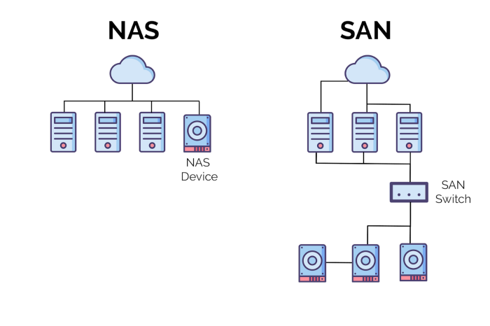
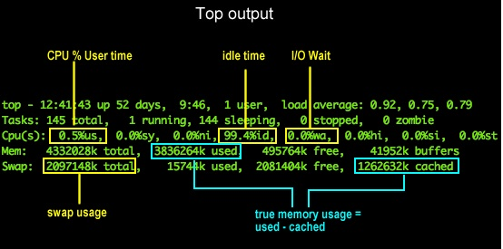
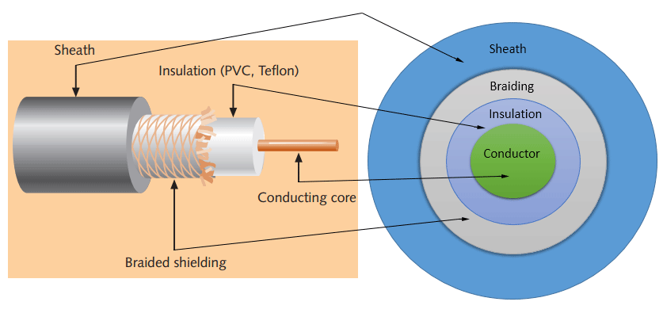

Linux Admin Guide
=================
**Guide to Administering Linux on RHEL, CentOS, Amazon AMI's**

```
Copyright 2021 - Abrar K
Copyright 2014 - Craig H

Licensed under the Apache License, Version 2.0 (the 'License');
you may not use this file except in compliance with the License.

Unless required by applicable law or agreed to in writing, software
distributed under the License is distributed on an 'AS IS' BASIS,
WITHOUT WARRANTIES OR CONDITIONS OF ANY KIND, either express or implied.

See the License for the specific language governing permissions and
limitations under the License.
```

- You may obtain a copy of the license at
    [Apache Licenses](http://www.apache.org/licenses/LICENSE-2.0)

## Table Of Contents
---

- [Linux Admin Guide](#linux-admin-guide)
  - [## Table Of Contents](#-table-of-contents)
  - [## Boot](#-boot)
    - [Boot Stages](#boot-stages)
    - [Systemd / System V](#systemd--system-v)
  - [## Process](#-process)
    - [Theory](#theory)
    - [Process Commands](#process-commands)
  - [## User and Group Administration](#-user-and-group-administration)
    - [Theory](#theory-1)
    - [Related Commands](#related-commands)
  - [## Hardware](#-hardware)
    - [System Related Commands](#system-related-commands)
    - [Network Related Commands](#network-related-commands)
    - [Filesystems Related](#filesystems-related)
    - [Time Settings Related](#time-settings-related)
  - [## File System](#-file-system)
  - [## File Operations](#-file-operations)
  - [## Storage Technology](#-storage-technology)
    - [NAS VS SAN](#nas-vs-san)
    - [Differences - NAS and SAN](#differences---nas-and-san)
    - [NAS and SAN Use Cases](#nas-and-san-use-cases)
  - [## Performance](#-performance)
  - [## Systemd](#-systemd)
    - [systemctl](#systemctl)
    - [journalctl](#journalctl)
    - [Further Reference](#further-reference)
  - [## Command Line](#-command-line)
  - [## Bash](#-bash)
  - [## Regex](#-regex)
  - [## Networking](#-networking)
  - [Cabling Technology](#cabling-technology)
    - [Coaxial Cable](#coaxial-cable)
    - [UTP & STP Cable](#utp--stp-cable)
    - [Fiber Optic](#fiber-optic)
  - [## Netcat](#-netcat)
  - [## iptables](#-iptables)
  - [## firewalld](#-firewalld)
  - [## SE Linux](#-se-linux)
  - [## YUM](#-yum)
  - [## GPG](#-gpg)
  - [## Python](#-python)
  - [## Sshuttle](#-sshuttle)
  - [## Mitmproxy](#-mitmproxy)
  - [## Tmux](#-tmux)
    - [Common Usage and Key Binds](#common-usage-and-key-binds)
  - [## Screen](#-screen)
  - [## Cron](#-cron)
  - [## SSH](#-ssh)
  - [## Apache](#-apache)
  - [## SSL](#-ssl)
  - [## PHP](#-php)
  - [## MySQL](#-mysql)
  - [## Memcache](#-memcache)
  - [## GIT](#-git)
  - [## Jq](#-jq)
  - [## Rsync](#-rsync)
  - [## Nginx](#-nginx)
  - [## Rsyslog](#-rsyslog)
  - [## vim](#-vim)
  - [## SQL](#-sql)
  - [## Node Exporter Monitoring](#-node-exporter-monitoring)

## Boot
---

### Boot Stages

* 6 Stages to Load Linux OS
    - BIOS
    - MBR
    - GRUB
    - Kernel
    - Init
    - Runlevel

* BIOS
    - Searches, loads, and executes the boot loader program.
    - It looks for boot loader in floppy, cd-rom, or hard drive. You can press a key (typically F12 of F2, but it depends on your system) during the BIOS startup to change the boot sequence.
    - Once the boot loader program is detected and loaded into the memory, BIOS gives the control to it.
    - So, in simple terms BIOS loads and executes the MBR boot loader.

* MBR
    - It is located in the 1st sector of the bootable disk. Typically /dev/hda, or /dev/sda
    - MBR is less than 512 bytes in size. This has three components 
        1. **Primary boot loader info** in 1st 446 bytes
        2. **Partition table info** in next 64 bytes
        3. **MBR validation check** in last 2 bytes.
    - It contains information about bootloaders (GRUB2 or LILO).
    - So, in simple terms MBR loads and executes the GRUB boot loader.

* GRUB2

  - If you have multiple kernel images installed on your system, you can choose which one to be executed.
  - GRUB2 displays a splash screen, waits for few seconds, if you don’t enter anything, it loads the default kernel image as specified in the grub configuration file.
  - GRUB2 has the knowledge of the filesystem (the older Linux loader LILO didn’t understand filesystem).
  - GRUB2 configuration file is /boot/grub2/grub.cfg (/etc/grub2.cfg is a symbolic link to this). 
  - The following is sample grub2.cfg of CentOS.
    ```
        ..... (skiped for breivity)
        ### BEGIN /etc/grub.d/10_linux ###
        menuentry 'CentOS Linux (3.10.0-514.el7.x86_64) 7 (Core)' --class centos --class gnu-linux --class gnu --class os --unrestricted $menuentry_id_option 'gnulinux-3.10.0-514.el7.x86_64-advanced-10bac86a-a9be-478c-b63f-46d3ca061e03' {
	        load_video
	        set gfxpayload=keep
	        insmod gzio
	        insmod part_msdos
	        insmod xfs
	        set root='hd0,msdos1'
	        if [ x$feature_platform_search_hint = xy ]; then
	            search --no-floppy --fs-uuid --set=root --hint-bios=hd0,msdos1 --hint-efi=hd0,msdos1 --hint-baremetal=ahci0,msdos1 --hint='hd0,msdos1'  a52207e4-01fd-4f12-98b7-681d56f21dc5
	        else
	            search --no-floppy --fs-uuid --set=root a52207e4-01fd-4f12-98b7-681d56f21dc5
	        fi
	        linux16 /vmlinuz-3.10.0-514.el7.x86_64 root=/dev/mapper/cl-root ro crashkernel=auto rd.lvm.lv=cl/root rd.lvm.lv=cl/swap rhgb quiet LANG=en_US.UTF-8
	        initrd16 /initramfs-3.10.0-514.el7.x86_64.img
        }
        menuentry 'CentOS Linux (0-rescue-9cdb9ab3246a4b3f9c0849ecd597f25e) 7 (Core)' --class centos --class gnu-linux --class gnu --class os --unrestricted $menuentry_id_option 'gnulinux-0-rescue-9cdb9ab3246a4b3f9c0849ecd597f25e-advanced-10bac86a-a9be-478c-b63f-46d3ca061e03' {
	        load_video
	        insmod gzio
	        insmod part_msdos
	        insmod xfs
	        set root='hd0,msdos1'
	        if [ x$feature_platform_search_hint = xy ]; then
	            search --no-floppy --fs-uuid --set=root --hint-bios=hd0,msdos1 --hint-efi=hd0,msdos1 --hint-baremetal=ahci0,msdos1 --hint='hd0,msdos1'  a52207e4-01fd-4f12-98b7-681d56f21dc5
	        else
	            search --no-floppy --fs-uuid --set=root a52207e4-01fd-4f12-98b7-681d56f21dc5
	        fi
	        linux16 /vmlinuz-0-rescue-9cdb9ab3246a4b3f9c0849ecd597f25e root=/dev/mapper/cl-root ro crashkernel=auto rd.lvm.lv=cl/root rd.lvm.lv=cl/swap rhgb quiet
	        initrd16 /initramfs-0-rescue-9cdb9ab3246a4b3f9c0849ecd597f25e.img
        }
    ```
  - As you notice from the above info, it contains kernel and initrd image.
  - So, in simple terms GRUB2 just loads and executes Kernel and initrd images.

  - Further reference: [TGK - Grub2 Configuration](https://www.thegeekdiary.com/centos-rhel-7-grub2-configuration-file-bootgrub2grub-cfg-explained/)

* Kernel

    * Mounts the root file system as specified in the “root=” in grub2.cfg
    * Kernel executes the /sbin/init program
    * Since init was the 1st program to be executed by Linux Kernel, it has the process id (PID) of 1. Do a ‘ps -ef | grep init’ and check the pid.
    * initrd stands for Initial RAM Disk.
    * initrd is used by kernel as temporary root file system until kernel is booted and the real root file system is mounted. It also contains necessary drivers compiled inside, which helps it to access the hard drive partitions, and other hardware.

* Init

    - Looks at the /etc/inittab file to decide the Linux run level.
    Following are the available run levels:
        ```
        0 – Halt, Poweroff
        1 – Single user mode
        2 – Multiuser, without NFS
        3 – Full multiuser mode
        4 – Unused
        5 – X11
        6 – Reboot
        ```
    - Init identifies the default initlevel from /etc/inittab and uses that to load all appropriate program.
    - Execute ‘grep initdefault /etc/inittab’ on your system to identify the default run level
    - If you want to get into trouble, you can set the default run level to 0 or 6. 
    - Since you know what 0 and 6 means, probably you might not do that.
    - Typically you would set the default run level to either 3 or 5.

* Runlevel

    - Depending on your default init level setting, the system will execute the programs from one of the following directories.
        ```
        Run level 0 – /etc/rc.d/rc0.d/
        Run level 1 – /etc/rc.d/rc1.d/
        Run level 2 – /etc/rc.d/rc2.d/
        Run level 3 – /etc/rc.d/rc3.d/
        Run level 4 – /etc/rc.d/rc4.d/
        Run level 5 – /etc/rc.d/rc5.d/
        Run level 6 – /etc/rc.d/rc6.d/
        ```
    - Please note that there are also symbolic links available for these directory under /etc directly. So, /etc/rc0.d is linked to /etc/rc.d/rc0.d.
    - Under the /etc/rc.d/rc*.d/ directories, you would see programs that start with S and K.
    - Programs starts with S are used during startup. S for startup.
    - Programs starts with K are used during shutdown. K for kill.
    - There are numbers right next to S and K in the program names. Those are the sequence number in which the programs should be started or killed.
    - For example:
      - S12syslog is to start the syslog deamon, which has the sequence number of 12. 
      - S80sendmail is to start the sendmail daemon, which has the sequence number of 80.
      - So, syslog program will be started before sendmail.


### Systemd / System V

* System Startup Files
    ```
    /etc/rc.d    - Scripts run from this subdir
    /etc/init.d  - Hard location for startup scripts. 
                - Linked to /etc/rc.d/rc0.d ..etc.
    /etc/rc.d/rc - File responsible for starting stopping services
    /etc/rc0.d   - Contains files with links to /etc/init.d/.
    k05atd       - kill,priority,service
    s05atd       - start,priority.service
    ```

* To start any script
    ```
    run /etc/init.d/<program> start 
    # To prevent startup, delete symlink
    ```

* To create new startup script
    ```
    Put script in /etc/init.d/myservice
    /etc/rc3.d ln s ../init.d/myservice
    ```

* Check for systemd or sysvinit
    ```
    pidof /sbin/init && echo "sysvinit" || echo "other"
    pidof systemd && echo "systemd" || echo "other"
    ```

* Systemd Targets

> Run-level in the classic SysVinit program| Description | Equivalent target-unit in the systemd program
> ---|---|---
>0 	| Shutdown all services and power off the system | poweroff.target
>1	| Single user mode for maintenance and recovery. Only the root account is allowed to log in. Networking is not available in this mode. | rescue.target
>2	| Multiuser mode without networking. | multi-user.target
>3	| Multiuser mode with networking. All users can login and access CLI prompt. No Graphical user interface is available. | multi-user.target
>4	| User-defined mode. Users can customize this run-level. Both command line and GUI (graphic user interface) are available for customization. | multi-user.target
>5	| X11 GUI with networking. All users can login into the system | graphical.target
>6 	| Shutdown all services and reboot the system. | reboot.target

<br> 

* Show Current Runlevel
    ```
    runlevel
    who -r
    ```

* Change default runlevel
    ```
    systemctl get-default
    systemctl set-default TARGET.target
    ```

* Change runlevel

        init 1 (Single user mode)

* Shutdown after 10 minutes.

        shutdown -h +10

* Further reference: [Systemd Essentials](https://www.digitalocean.com/community/tutorials/systemd-essentials-working-with-services-units-and-the-journal)

## Process
---

### Theory

* Process States

    Init process is the first process when linux boots up
        
        pidof systemd
        >1

    There are 5 states for a process

    State | Explanation
    --- | ---
    R | RUNNING/RUNNABLE
    S | INTERRRUPTABLE_SLEEP
    D | UNINTERRUPTABLE_SLEEP
    T | STOPPED
    Z | ZOMBIE

    <br>

    Background Jobs
    
        & or ctrl+z

    Foreground Jobs

        jobs
        fg %1

* Signals

    - Signals notify an process of an event. 
    - Similar to how a hardware sends kernel interupts. 
    - Programs only recognize signals if they are programmed to do so.

    Shows all available signals

        kill -l

    Signal Types:

    Signal | Explanation
    --- | ---
    SIGINT2 | Interrupt. Sent when user hits Control + C
    SIGHUP1 | Terminal is closed without closing - Sent by OS
    SIGQUIT  | Sent when executing quit signal -  Ctrl + D
    SIGKILL9 | Terminates immediately and without out cleaning up.
    SIGTERM15 | Kill uses this by default. Clean shutdown.
    SIGTSTP20 | Sent when executing Control + Z

<br>

* System Calls

  - When a program does open, fork, read, or write its doing a system call. 
  - It is how a program enters the kernel.
  - It instructs the kernel to do something on its behalf. 
  - Why doesn’t the user application run itself? 
  - *Because of protection ring levels.*
    - Users are ring3 while kernel is ring0.
    - Further reference: [Wikipedia - Protection Ring](https://www.google.com/url?sa=t&rct=j&q=&esrc=s&source=web&cd=&cad=rja&uact=8&ved=2ahUKEwjq4a6Hqa_wAhUbbn0KHcejC9sQFjACegQIBBAD&url=https%3A%2F%2Fen.wikipedia.org%2Fwiki%2FProtection_ring&usg=AOvVaw2j6xHm3h_xdrlxLVXAuy6K)

* User Space and Kernel Space

  - Processes in user space only have access to small part of memory. Thus user process cannot do IO or have a hardware access.
  - Kernel has all access. Access to kernel space are by system calls.
  - User processes sends an interupt to kernel if it wasn’t to write a file. 
  - Rings are utilize so programs that they do not interfere with each other.

### Process Commands 

* Killing Processes

    - Common KILL signlas
    ```
        1       HUP (hang up)
        2       INT (interrupt)
        3       QUIT (quit)
        6       ABRT (abort)
        9       KILL (non-catchable, non-ignorable kill)
    ```

    - Each process is supplied with a set of standard signal handlers by the operating system in order to deal with incoming signals. 
    - When no signal is explicitly included in the command, signal 15, named SIGTERM, is sent by default. 
    - If this fails, the stronger signal 9, called SIGKILL

* Kill all users processes

    ```
    killall -u username
    ```

* Kill all processes by name

    ```
    killall firefox
    pkill -9 firefox
    ```

* Get process id

    ```
    pgrep bash
    ```

* Reload process

    ```
    sudo kill -HUP pid_of_apache
    ```

* Display users accessing a process using file/folder

    ```
    fuser -u file/folder
    ```

* Kill processes using file/folder

    ```
    fuser -k file/folder
    ```


## User and Group Administration
---

### Theory

* Password file syntax

  - File loacation: ```/etc/passwd```

    ```
    root:x:0:0:root:/root:/bin/bash
     |   | | |   |     |     |
     1   2 3 4   5     6     7
    ```

    1. ```Username:``` *It is used when user logs in. It should be between 1 and 32 characters in length.*
    2. ```Password:``` *An x character indicates that encrypted password is stored in /etc/shadow file.*
    3. ```User ID (UID):``` *Each user must be assigned a user ID (UID). UID 0 (zero) is reserved for root and UIDs 1-99 are reserved for other predefined accounts. Further UID 100-999 are reserved by system for administrative and system accounts/groups.*
    4. ```Group ID (GID):``` *The primary group ID (stored in /etc/group file).*
    5. ```User ID Info:``` *The comment field. It allow you to add extra information about the users such as user's full name, phone number etc. This field use by finger command.*
    6. ```Home directory:``` *The absolute path to the directory the user will be in when they log in. If this directory does not exists then users directory becomes /home*
    7. ```Command/shell:``` *The absolute path of a command or shell (/bin/bash). Typically, this is a shell. Please note that it does not have to be a shell.*

* System User vs Normal User

    - System users will be created with no aging information in /etc/shadow.
    - Their numeric identifiers are chosen in the SYS_UID_MIN–SYS_UID_MAX range, defined in /etc/login.defs instead of UID_MIN–UID_MAX (and their GID counterparts for the creation of groups).
      - On CentOS: 
        - Although useradd --system foouser creates no home directory for that user. 
    - Service accounts often don't have a "proper" login shell, i.e. they have /usr/sbin/nologin. 
    - Moreover, service accounts are typically locked, i.e. it is not possible to login (for traditional /etc/passwd and /etc/shadow this can be achieved by setting the password hash to arbitrary values such as * or x)

### Related Commands

* Become system administrator:

    ```
    sudo -s
    sudo su
    ```

  - The accounts capable of using sudo are specified in ```/etc/sudoers```, which is edited with the ```visudo``` utility.
  - By default, relevant logs are written to ```/var/log/secure```.

* Switch user

    ```
    su - user2
    ```
  - Argument "-" provides an environment similar to what the user would expect had the user logged in directly.

* Change password

    ```
    passwd <username>
    ```

* Change `root` password

        Access Boot (GRUB) Menu
        ------------------------
        init 6

        Edit Boot Options
        ------------------
        1. Press 'e' at the needed highlighted kernel entry
        2. For RHEL/CentOS 7, the line starts with 'linux16'.
        3. For RHEL/Centos 8, and Fedora the line starts with 'linux'.
        4. Add 'rd.break' at the end of that line
        5. Hit Ctrl+X for reboot.

        After Reboot
        ------------
        mount -o remount rw /sysroot
        chroot /sysroot
        passwd
        touch /.autorelabel
        exit
        reboot

  - References:
    - [RedHat Recover root Password](https://www.redhat.com/sysadmin/recover-root-passwd)
    - [Unixmen Reset root Password](https://www.unixmen.com/reset-root-password-centos-7/)

* Change password expiration

    ```
    chage -l <username> **(View all password policies)**

    chage -E never <username>  **(Sets to never expire)**
    ```

* Lock user password

    ```
    usermod -L username
    ```

* Unlock user password

    ```
    usermod -U username
    ```

* Define default attributes for new users (UID, Password Expiriny, HomeDir)

    ```
    cat /etc/login.defs
    ```

* Add User

    ```
    add user user1
    ```


* Show last logged in

    ```
    last
    last log     # show when the last log started
    last reboot  # shows last reboot
    ```

* Show users groups

    ```
    groups <username>
    ```

* Add User to Sudo

    ```
    usermod -a -G <group to add> <username>
    ```

* Change default sudo timeout (in minutes)

  - Add the line below to /etc/sudoers

    ```
    Defaults    timestamp_timeout=<value>
    ```

* Edit Group Config

        vim /etc/group

    ```
        cdrom:x:24:vivek,student13,raj
    ```
    - Explanation:
      1. ```Group Name:``` It is the name of group. If you run ls -l command, you will see this name printed in the group field.
      2.  ```Password:``` Generally password is not used, hence it is empty/blank. It can store encrypted password. This is useful to implement privileged groups.
      3. ```Group ID (GID):``` Each user must be assigned a group ID. You can see this number in your /etc/passwd file.
      4. ```Group List:``` It is a list of user names of users who are members of the group. The user names, must be separated by commas.
    

* List Logged In User

    ```
    users
    ```

* Show User Info (User ID, Group ID)

    ```
    id <username>
    ```

* Show All Users with Hosts Originated

    ```
    who -umH
    ```

* Chat To Other User Logged In

    ```
    talk
    ```

* Temporarily Prevent Logins Systemwide 

    ```
    echo "Sorry no login now" > /etc/nologin
    ```
  - Applicable for all users but root.
  - The message in nologin will be displayed.
  - *Might not work users with SSH pre-shared keys.* 

## Hardware
---

### System Related Commands

* Print full date and time:
    ```
    date
    ```

* Print the hostname of this machine:
    ```
    echo $HOSTNAME
    ```

* Print the session timeout:
    ```
    echo $tmout
    ```

* Print information about current Linux distro:
    ```
    lsb_release -a
    cat /etc/*-release
    cat /proc/version
    ```

* Print Linux kernel version:
    ```
    uname -a
    ```

* Print information about kernel modules:
    ```
    lsmod
    ```

* Configure kernel modules (never do this):
    ```
    modprobe
    ```

* Look for messages from drivers:
    ```
    dmesg
    ```

* Print environment variables:
    ```
    printenv
    ```

* List hardware connected via PCI ports:
    ```
    lspci
    ```

* List hardware connected via USB ports:
    ```
    lsusb
    ```

* Print hardware info stored in BIOS:
    ```
    dmidecode
    sysreport
    ```

* Dump info about keyboard drivers:
    ```
    dumpkeys
    ```

* Show default kernel
    ```
    grubby –default-kernel
    ```

* Modify kernel parameters
    ```
    nano /etc/sysctl.conf
    ```

* Show Memory information

        
        cat /proc/meminfo

* Show Number of Cores

        lscpu

* Common Hardware Info

        cat /proc/cpuinfo                  # CPU model
        cat /proc/meminfo                  # Hardware memory
        grep MemTotal /proc/meminfo        # Display the physical memory
        watch -n1 'cat /proc/interrupts'   # Watch changeable interrupts continuously
        free -m                            # Used and free memory (-m for MB)
        cat /proc/devices                  # Configured devices
        lspci -tv                          # Show PCI devices
        lsusb -tv                          # Show USB devices
        lshal                              # Show a list of all devices with their properties
        dmidecode                          # Show DMI/SMBIOS: hw info from the BIOS

* Hardware Virtulaization Enabled

        egrep -wo 'vmx|ept|vpid|npt|tpr_shadow|flexpriority|vnmi|lm|aes' /proc/cpuinfo  | sort | uniq\ 
        | sed -e 's/aes/Hardware encryption=Yes (&)/g' \ 
        -e 's/lm/64 bit cpu=Yes (&)/g' -e 's/vmx/Intel hardware virtualization=Yes (&)/g'

### Network Related Commands

* Dump captured data off of wireless card:

    ```
    dumpcap
    ```

* Print information about ethernet
    ```
    ethtool
    ```

### Filesystems Related

* Make a bootable USB
    ```
    dd if=efidisk.img of=/dev/usb (usb device name)
    ```

* Make a swap file
    ```
    dd if=/dev/zero of=/opt/myswap bs=1024 count=4
    mkswap /opt/myswap
    swapon -a

    For adding this myswap at boot time, add following in /etc/fstab file:
    /opt/myswap swap swap defaults 0 0
    ```

* Backup & Restore MBR
    ```
    Backup: dd if=/dev/sda of=/tmp/mbr.img_backup bs=512 count=1

    Restore: dd if=/tmp/mbr.img of=/dev/sda bs=512 count=1
    ```

  - The MBR  is a 512 byte segment on the very first sector of your hard drive composed of three parts: 
    1. ```The boot code``` which is 446 bytes long
    2. ```The partiton table``` which is 64 bytes long
    3. ```The boot code signature``` which is 2 bytes long.

### Time Settings Related

* Checking if system time is syncing with NTP

        timedatectl                 # Check command
        timedatectl set-ntp true    # Set NTP true

* Sync NTP time

        sudo service ntp stop
        sudo ntpdate -s time.nist.gov
        sudo service ntp start

* Sync NTP time with chrony

        sudo yum install chrony
        sudo systemctl enable chronyd
        sudo systemctl start chronyd
        chronyc tracking
        chronyc sources

## File System
---

* Linux File Systems Explained:

  [TLDP Article](http://www.tldp.org/LDP/Linux-Filesystem-Hierarchy/html/)

* inodes

  - An inode stores basic information about a regular file, directory, or other file system object
  - iNode number also called as index number, it consists following attributes:

   Attribute | Explanation
   ---|---
   File type | Executable, block special, etc.
   Permissions |  Read, write, execute, etc.
   Owner | Owner of the file
   Group | Group the file belongs
   File Size | Size in KB
   File access, change and modification time | Reminder:  UNIX or Linux never stores file creation time. This is favorite question asked in interviews.
   File deletion time | Time the file was deleted
   Number of links (soft/hard) | As advertised
   Extended attribute | Append only or no one can delete file including root user (immutability)
   Access Control List (ACLs) | Table that tells a computer operating system which access rights each user has to a particular system object
<br>

* Show inodes of files and folders

        df -i
        ls -i
        stat

* Clean inodes if inodes is full (Cant create new files in filesystem)

   - Result: `Disk cannot be written`
   - **Why?**
     - Log files (error logs/admin logs)
     - PHP session files
     - mod cache disk (Apache/Nginx)
   - How to tackle 
        
  ```
  General
  --------
  for i in /*; do echo $i; find $i |wc -l; done
  
  Drill down in /var
  ------------------
  for i in /var/*; do echo $i; find $i |wc -l; done

  Found /var/cache/apache2/modcachedisk is using 100% inodes.
  
  Remove the files and folder
  ---------------------------
  rm -rf /var/cache/apache2/modcachedisk

  Restart Apache and server
  -------------------------
  service apache2 restart
  reboot
  ```

  - References:
    - [DO Clear inodes](https://www.digitalocean.com/community/questions/best-way-to-clear-inodes)
    - [Toolbox Forum inodes](https://www.toolbox.com/tech/operating-systems/question/how-to-clean-up-inodes-112612/)
<br>

* Display mountpounts

        lsblk #show all mounted drives
        findmnt #show mountpoints
        sudo fdisk -l
        df -h
        df -h --output=source,target

* Add a new disk to RHEL server using LVM

  Step | Command | Explanation
  -- | --- | ---
  1 | lsblk -fp |  Find drive which is not mounted
  2 | pvcreate /dev/sdx | Create new physical volume
  3 | pvs | Show physical volume
  4 | vgs | Show volume group
  5 | vgextend <target_vg> /dev/sdx | Extend /dev/sdx to the target volume group
  6 | vgs | Check again if the drive have been added
  7 | lvs | Show all logical volume in the server
  8 | lvextend -l +100%FREE -r <target_lv> | Extend 100% free capacity of /dev/sdx to the target logical volume. 
<br>

* Add a new Amazon EBS disk to server

  Step | Command | Explanation
  -- | --- | ---
  1 | lsblk |  Find drive which is not mounted
  2 | sudo mkfs -t ext4 /dev/xvdf OR sudo mkfs -it xfs /dev/xvdf | Makes file system on /dev/xvdf
  3 | sudo mkdir /mnt/my-data | Make a mount point
  4 | sudo mount /dev/xvdf /mnt/my-data | Mount device
<br>

* Show Physical Volumes

        pvdisplay
        pvs

* Create Volume Group

  - A **group of physical volumes or disks are combined together into a single storage file** 
  - Usually referred to as the **LVM volume group**.

        sudo vgcreate <volume-name> <device-1> <device-2> <device-3>

* Create Logical Volumes

        sudo lvcreate –name <logical-volume-name> –size <size-of-volume> <volume-group-name>

* Display Logical Volumes

        sudo lvdisplay

* Format Logical Volume

        mkfs -t ext4 /dev/<lvm-name>

* Zero Out all blocks for performance

        if=/dev/zero of=/dev/xvdf bs=1M

* Resize Filesystem

        resize2fs

*  LVM Backup and Restore

        Backup
        ------
        vgcfgbackup [-f path_newfilename ] vg_name

        Restore
        -------
        vgcfgrestore [-f|--file <filename>] [-t|--test] [-v] vg_name

    - Reference:
      - [Backup LVM Configuration](https://linoxide.com/how-to-backup-lvm-configuration-on-linux/#:~:text=The%20vgcfgrestore%20command%20restores%20LVM,is%20activated%20in%20shared%20mode.)
      - [Increase or Decrease LVM](https://www.golinuxcloud.com/resize-root-lvm-partition-extend-shrink-rhel/)
<br>

* Raid Levels

Levels | Definition
--- | ---
RAID 0 | Striping
RAID 1 | Mirroring
RAID 5 | Striping with parity
RAID 6 | Striping with double parity
RAID 10 | Combining mirroring and striping
<br>

Type | Explanation | Required Disk (at least) | Benefits | Cons
--- | --- | --- | --- | ---
0 | Striped set without parity or Striping | 2 |  Easy to implement, All storage capacity is used | Not fault-tolerant
1 | Mirrored set without parity or Mirroring | 2 | Excellent read/write speed, In case a drive fails data do not have to be rebuild | Do not always allow a hot swap, Storage capacity is only half of the total drive capacity
0+1 | Hybrid - Arrays are created and they are each mirrored via an overall RAID 1 (data backup) array. | 4 | Increased speed, Backup safety | Complex technology
1+0 | Mirrors two drives together and then creates a striped set with the pair. | 3 | Rebuild time is very fast | Half of the storage capacity goes to mirroring - Expensive Redundancy
5 | Consists of block-level striping with distributed parity | 3 | Backup safety, Increased speed, Fault-tolerant, No data lost | Complex technology, Drive failures have an effect on throughput
6 | Consists of block-level striping with double distributed parity | 4 | Very high fault tolerance, Great for archiving | Write data transactions are slow, Rebuilding RAID array takes longer time
<br>

* Creating RAID using mdadm 

  - Create RAID

        mdadm --create --verbose /dev/md0 --level=z --raid- devices=number_of_volumes device_name-x device_name-y

  - Levels **(z)** will determine the RAID array created

        0 - RAID 0
        1 - RAID 1
        5 - RAID 5
        6 - RAID 6
        10 - RAID 10

  - Further reference: [RAID Creation](https://www.digitalocean.com/community/tutorials/how-to-create-raid-arrays-with-mdadm-on-ubuntu-16-04)

* Mount a new file system

        fdisk /dev/hda1  # create new partision
        mkfs /dev/hda1   # create file system
        mount -a         # Mount all FS in /etc/fstab


* Define boot disk

        vim /etc/fstab
        
        # Add entries as shown below

        UUID=62bc3131-c8dd-4287-9430-7cd471081663 /boot   xfs     defaults        0 0
        
        *xfs= filesystem
        *defaults = mount on boot

* Check for bad blocks

        sudo badblocks -s /dev/sda

* Read speed test

        sudo hdparm -tT /dev/sda

* Write speed test. 16KB random write operations

        fio --directory=/media/p_iops_vol0 --name fio_test_file --direct=1 --rw=randwrite --bs=16k --size=1G --numjobs=16 --time_based --runtime=180 --group_reporting --norandommap

## File Operations
---

* Find where a commmand is executed from

        which
        ie: which python  > /usr/bin

* list directories and recurse into subdirectories

        ls -r

* Find files bigger than 100m

        find . -size +100M

* Find files created within last 7 days

        find . -mtime -7

* Find files accessed within last 7 days

        find . -atime -7

* Find Disk Usage by Directory

        du -sh /home/*

  - Using the ```-c``` option with the ```du``` command will show the grand total of used space for the designated directory

* Find Files

        Find . -name http*

* Find all files not owned by root:

        find . \! -user root -print

* Find all files not with permissions 644:

        find . \! -perm 644 root -print

* Find files matching [filename]:

        locate [filename]

* Check a file type

        file <filename>

* Show uncommented items in config file

        grep -v '^\s*$\|^\s*\#' temp

* Search for a given string in all files recursively

        grep -r "ramesh" *

* View the differences between two files:

        sdiff [file 1] [file 2]

* Change File Permissions

        # Examples
        chmod 775 filename
        chmod o+r file.txt

        # Options
        7 = Read + Write + Execute
        6 = Read + Write
        5 = Read + Execute
        4 = Read
        3 = Write + Execute
        2 = Write
        1 = Execute
        0 = All access denied

        + - add
        - - remove

        u - user
        g - group
        o - other

        r - read
        w - write
        x - execute
        

  - First number is for the owner, second for the group, and third for everyone.
  - How to calculate permission? Use [Calculate Permission](http://permissions-calculator.org/)

* Print the default file permissions (Subtract from 777):
    ```
    echo $umask
    ```

* Permissions On Folders

        r: read only the names of the files in the directory
        w: create and delete of the files in the directory
        x: traverse the directory

* Permissions On files

        r: open a file for reading (e.g. with the cat command)
        w: write a file (e.g. use sed -i (inplace) on it)
        x: execute a file

  - It is important to note that a script can be executed even by a user who doesn’t have the execute permission on it. 
  - Passing a Python script path to the Python executable will cause Python to open the file for reading and then interpret it.
  - **So it is not safe to rely on the executable permission for security.**
  - This goes for PHP, Perl, Ruby, Javascript, etc.

* Copy permissions of one file onto another

        getfacl FILE1 | setfacl –set-file=- FILE2

* Show permissions on all directories in a tree

        namei -om /var/www/iddb.com/static

* Making files immutable `chattr`

        Show file attributes
        ---------------------
        lsattr

        Make file(s) immutable
        -----------------------
        chattr +i /etc/passwd

        Unset immutable attribute
        -------------------------
        chattr -i /etc/passwd

        Append data without modifying
        -----------------------------
        chattr +a example.txt

        Secure Directory
        ----------------
        chattr -R +i myfolder

  - Reference:
    - [Techmint chattr](https://www.tecmint.com/chattr-command-examples/)

* Remove directory

        rmdir directory

* Copy Files from Remote Machine to Local Machine

        scp user@source:/path destdirectory

* Copy Local directory to remote machine

        scp -rp sourcedirectory user@dest:/path

* Copy Remote directory to local path

        scp -r user@your.server.example.com:/path/to/foo /home/user/Desktop/

* Copy hello.txt from local computer to remote home directory

         scp hello.txt awshost1:~/

* Copy hello.txt from local to remote home directory, renaming it foo.txt

        scp hello.txt awshost1:~/foo.txt

* Copying ~/foo.txt from the remote computer to the current local director

        scp awshost1:~/foo.txt .

* Copying ~/foo.txt from remote to local directory cc, renaming it a.b

        scp awshost1:~/foo.txt cc/a.b

* Compress a directory

        tar -zcvf archive-name.tar.gz directory-name
        
        -c = create
        -f = following is archive name
        -v = verbose
        -z = gzip

* To append file to archive


        tar rvf archive_name.tar new file.txt

* Encrypt a file:

        gpg -o [outputfilename.gpg] -c [target file]

* Decrypt a file:

        gpg -o [outputfilename] -d [target.gpg]

* Uncompress file

        unzip filename.zip

* Open a compressed .tgz or .tar.gz file:

        # Normal extract
        tar -xzvf [target.tgz]

        # Extracts without its parent folder
        tar -xzvf —strip-components 1 [target.tgz]

        # Extracts to a different directory
        tar -xzvf -C [target.tgz]

* Config Files

  - Most of the config files are located in /etc

        # Default settings template for new user accounts
        /etc/login.def

        # Message of the day
        /etc/motd

        # Default run-level
        /etc/inittab - *id:3:initdefault:

* Logs

Name | Function
--- | ---
auth.log		|		Authentication logs
boot.log		|		Boot logs
btmp			|		Invalid login attempts
cron                 	|                Cron logs
daemon.log        	|	        Logs for specific service (daemons)
dmesg			|		Kernel boot messages
httpd/			|		Apache logs
kern.log		|		Kernel logs
mail*			|		Mail server logs
messages		|		General/all logs
mysql*			|		MySQL logs
secure			|		Security/authentication logs
syslog			|		All system logs
wtmp			|		User logins and logouts
<br>

* Check Logs

  - You can use a lot of ways to check the logs
  - ```less``` is an option not just **THE** option. 
  
        less /var/log/messages
        less /var/log/secure
        less /var/log/auth

* Check disk space

        df -h # For human readable


* Check file system consistency

        Goto single user mode:
        # init 1

        Unmount file system:
        # umount /dev/sdb1

        Now run fsck command:
        # fsck /dev/sdb1

* Generate md5

        md5 <filename>

* Generate sha256

        openssl sha -sha256 <filename> (mac)

* Symbolic Links

        ┌── ln(1) link, ln -- make links
        │   ┌── Create a symbolic link.
        │   │                         ┌── the path to the intended symlink
        │   │                         │   can use . or ~ or other relative paths
        │   │                   ┌─────┴────────┐
        ln -s /path/to/original /path/to/symlink
        └───────┬───────┘
                └── the path to the original file/folder
                        can use . or ~ or other relative paths

* Change the open files limit from 1024 to 10240 d

        ulimit -n 10240     # This is only valid within the shell

  - Login users and applications can be configured in /etc/security/limits.conf

* System wide limits

    Command | Explanation
    --- | ---    
    sysctl -a                    |      # View all system limits
    sysctl fs.file-max           |      # View max open files limit
    sysctl fs.file-max=102400    |      # Change max open files limit
    echo "1024 50000" > /proc/sys/net/ipv4/ip_local_port_range | # Port range
    cat /etc/sysctl.conf       |        # Show default system wide limits config
    fs.file-max=102400         |        # Permanent entry in sysctl.conf
    cat /proc/sys/fs/file-nr   |        # How many file descriptors are in use

    - Reference:
      - [Tecmint Sysctl](https://www.tecmint.com/change-modify-linux-kernel-runtime-parameters/)

<br>

* Find opened files on a mount point with fuser

        fuser -m /home

## Storage Technology
---



### NAS VS SAN

NAS | SAN
---|---
Typically used in homes and small to medium sized businesses. | Typically used in professional and enterprise environments.
Less expensive	| More expensive
Easier to manage | Requires more administration
Data accessed as if it were a network-attached drive (files) | Servers access data as if it were a local hard drive (blocks)
Speed dependent on local TCP/IP usually Ethernet network, typically 100 megabits to one gigabit per second. Generally slower throughput and higher latency due to slower file system layer. | High speed using Fibre Channel, 2 gigabits to 128 gigabits per second. Some SANs use iSCSI as a less expensive but slower alternative to Fibre Channel.
I/O protocols: NFS, SMB/CIFS, HTTP | I/O protocols: SCSI, iSCSI, FCoE
Lower-end not highly scalable; high-end NAS scale to petabytes using clusters or scale-out nodes | Network architecture enables admins to scale both performance and capacity as needed
Does not work with virtualization | Works with virtualization
Requires no architectural changes | Requires architectural changes
Entry level systems often have a single point of failure, e.g. power supply | Fault tolerant network with redundant functionality due to SAN Fabric Switch.
Susceptible to network bottlenecks | Not affected by network traffic bottlenecks. Simultaneous access to cache, benefiting applications such as video editing.
File backups and snapshots economical and schedulable. | Block backups and mirrors require more storage.
<br>

### Differences - NAS and SAN

1)  `Fabric.` 
    - NAS uses TCP/IP networks, most commonly Ethernet. Traditional SANs typically run on high speed Fibre Channel networks, although more SANs are adopting IP-based fabric because of FC’s expense and complexity. 
    - High performance remains a SAN requirement and flash-based fabric protocols are helping to close the gap between FC speeds and slower IP.

2)  `Data processing.` 
    - The two storage architectures process data differently: NAS processes file-based data and SAN processes block data. 
    - The story is not quite as straightforward as that of course: NAS may operate with a global namespace, and SANs have access to a specialized SAN file system. 
    - A global namespace aggregates multiple NAS file systems to present a consolidated view. SAN file systems enable servers to share files. Within the SAN architecture, each server maintains a dedicated, non-shared LUN. 
    - SAN file systems allow servers to safely share data by providing file-level access to servers on the same LUN.

3)  `Protocols.` 
       - NAS connects directly to an Ethernet network via a cable into an Ethernet switch. 
       - NAS can use several protocols to connect with servers including NFS, SMB/CIFS, and HTTP. 
       - On the SAN side, servers communicate with SAN disk drive devices using the SCSI protocol. 
       - The network is formed using SAS/SATA fabrics, or mapping layers to other protocols such as Fibre Channel Protocol (FCP) that maps SCSI over Fibre Channel, or iSCSI that maps SCSI over TCP/IP.

4)  `Performance.` 
       - SANs are the higher performers for environments that need high-speed traffic such as high transaction databases and ecommerce websites. 
       - NAS generally has lower throughput and higher latency because of its slower file system layer, but high-speed networks can make up for performance losses within NAS.

5)  `Scalability.` 
     - Entry level and NAS devices are not highly scalable, but high-end NAS systems scale to petabytes using clusters or scale-out nodes. 
     - In contrast, scalability is a major driver for purchasing a SAN. 
     - Its network architecture enables admins to scale performance and capacity in scale-up or scale-out configurations.

6)  `Price.` 
     - Although a high-end NAS will cost more than an entry-level SAN, in general NAS is less expensive to purchase and maintain. 
     - NAS devices are considered appliances and have fewer hardware and software management components than a storage area network. 
     - Administrative costs also figure into the equation. 
     - SANs are more complex to manage with FC SANs on top of the complexity heap. 
     - A rule of thumb is to figure 10 to 20 times the purchase cost as an annual maintenance calculation.

7)  `Ease of management.` 
     - In a one-to-one comparison, NAS wins the ease of management contest. The device easily plugs into the LAN and offers a simplified management interface. 
     - SANs require more administration time than the NAS device.
     - Deployment often requires making physical changes to the data center, and ongoing management typically requires specialized admins. 
     - The exception to the SAN-is-harder argument is multiple NAS devices that do not share a common management console.

### NAS and SAN Use Cases

* `NAS`: **When you need to consolidate, centralize, and share.**

  - `File storage and sharing.` This is NAS major use case in mid-sized, SMB, and enterprise remote offices. A single NAS device allows IT to consolidate multiple file servers for simplicity, ease of management, and space and energy savings.

  - `Active archives.` Long-term archives are best stored on less expensive storage like tape or cloud-based cold storage. NAS is a good choice for searchable and accessible active archives, and high capacity NAS can replace large tape libraries for archives.

  - `Big data.` Businesses have several choices for big data: scale-out NAS, distributed JBOD nodes, all-flash arrays, and object-based storage. Scale-out NAS is good for processing large files, ETL (extract, transform, load), intelligent data services like automated tiering, and analytics. NAS is also a good choice for large unstructured data such as video surveillance and streaming, and post-production storage.

  - `Virtualization.` Not everyone is sold on using NAS for virtualization networks, but the usage case is growing and VMware and Hyper-V both support their datastores on NAS. This is a popular choice for new or small virtualization environments when the business does not already own a SAN.

  - `Virtual desktop interface (VDI).` Mid-range and high-end NAS systems offer native data management features that support VDIsuch as fast desktop cloning and data deduplication.

* `SAN`: **When you need to accelerate, scale, and protect.**

  - `Databases and e-commerce websites.` General file serving or NAS will do for smaller databases, but high-speed transactional environments need the SAN’s high I/O processing speeds and very low latency. This makes SANs a good fit for enterprise databases and high traffic ecommerce websites.

  - `Fast backup.` Server operating systems view the SAN as attached storage, which enables fast backup to the SAN. Backup traffic does not travel over the LAN since the server is backing up directly to the SAN. This makes for faster backup without increasing the load on the Ethernet network.

  - `Virtualization.` NAS supports virtualized environments, but SANs are better suited to large-scale and/or high-performance deployments. The storage area network quickly transfers multiple I/O streams between VMs and the virtualization host, and high scalability enables dynamic processing.

  - `Video editing.` Video editing applications need very low latency and very high data transfer rates. SANs provide this high performance because it cables directly to the video editing desktop client, dispensing with an extra server layer. Video editing environments need a third-party SAN distributed file system and per-node load balancing control.

## Performance
---

* Load Average

  - The "Number of cores = MAX load"
  - The three numbers represent averages over progressively longer periods of time.
    - 1, 5, and 15 minutes averages
  - Rule of Thumb: 
    - On a multicore system, your load should not exceed the number of cores available.
    - On a dual-core CPU, I won't even think about it until load gets and stays above 1.7 or so
  - Which average should I be observing? One, five, or 15 minute?
    - You should be looking at the five or 15-minute averages. 
  - Frankly, if your box spikes above 1.0 on the one-minute average, you're still fine.
  - It's when the 15-minute average goes north of 1.0 and stays there that you need to snap to.
  - How do I know how many cores my system has? 
  ```grep 'model name' /proc/cpuinfo | wc -l```


* Show running services with their ports

        lsof -i     # Monitors real-time network connections


* Show what files a process has open

        lsof -p $PID
        netstat -lptu

* top

    

  - Toggle Keys
    - Upper case **M** -> Sorts by memory usage
    - Lower case **c** -> Shows full command list

* What to consider in terms of performance?

Key | What to look for?
--- | ---
**CPU io wait** | Represents CPU waiting for disk I/O. Check for server slowness. If it is low then you can rule out disk access. GT > 10% is high means disk is slow.
**CPU idle time** | Higher the number the more bandwidth available to server. Should be >25%
**CPU user time** | Time spent on processor running your program. If idle time is low, you can expect this to be high. Find process taking up CPU.
**CPU system time** | The time spent in operating system kernel.
**CPU steal time** | Virtual machines are competing for resources. If %st increases on all VM's, means your VM is using too much CPU. Else %st increases on just one VM = physical CPU is oversold.
**Memory Usage** | Don't look at the "free" memory -- it's misleading. To get the actual memory available, subtract the "cached" memory from the "used" memory. This is because Linux caches things liberally, and often the memory can be freed up when it's needed
Memory Usage * | True memory usage = Memory used - Swap cached
**Load** | How many processes are waiting to run?
Load * | < 0.7 = healthy (on single core machine)
Load * | 1.0 = system is fully used (on single core machine)
Load * | 1.0 on single core, 4.0 on quad core
Load * | Broken down by one minute, 5 minutes, 15 minutes
Load * | ```lscpu``` - Shows how many cores available
**Swap cached** |  Caches files in the filesystem in memory for better performance. Uses spare memory.
**Swap total vs Swap free** | If they are equal there is no swapping going on.
<br>

* Show open tcp sockets
  
        lsof -nPi tcp

Key | Usage
--- | ---
-n | This option inhibits the conversion  of  network  numbers  to  host  names  for  network  files.
-P | This option inhibits the conversion of port numbers to port names for network files.
-i [tcp] | This  option  selects  the  listing  of  files any of whose Internet address matches the address specified in i.
<br>

  Reminder | Notes
  --- | ---
  1 | Inhibiting the  conversion  may  make lsof run a little faster.
  2 | It is also useful when port name lookup is not working properly.
<br>

* Show bandwidth usage per connection

        iftop

* Show Ports listening with thir process id

        netstat -tlnp (show ports listening with their process id)

Key | Explanation
--- | ---
-l, --listening | Show only listening sockets.  (These are omitted by default.)
-n, --numeric | Show numerical addresses instead of trying to determine symbolic host, port or user names.
-p, --program | Show the PID and name of the program to which each socket belongs.
-t, --tcp | Show only tcp
<br>

* Show Ports listening - **Mac ONLY**

        nettop

* Show bandwith ussage per process

        nethogs

* Show running services

        # ps commands
        ps –eaf
        ps aux
        ps –ax

        ## ps options
        --------------
        a = show processes for all users
        u = display the process's user/owner
        x = also show processes not attached to a terminal
        f = full format lsiting

        # pstree command
        pstree
        pstree -n
        pstree -a

        ## pstree options
        ------------------
        a = include command argument
        n = sort by PID

  - Further references: [ps](https://www.journaldev.com/24613/linux-ps-command), [pstree](https://www.howtoforge.com/linux-pstree-command/)

* Better top with cleaner interface:

        htop

* Stop a process from using all system resources and lagging computer:


        nice [process name]

  - nice command is used for changing priority of the jobs.
  - Syntax: ```nice [OPTION] [COMMAND [ARG]…]```
  - Range of priority goes from **-20 (highest priority) to 19 (lowest)**.
  - Priority is given to a job so that the most important job is executed first by the kernel and then the other least important job

* Show all ruby-related PIDs and processes

        pgrep -fl ruby

* Whats a process doing?

        strace -f -p $PID

* Show every call a program is making

        strace python myprogram.py # Dont run on Production DB
        opensnoop -p pid           # Same as strace but faster

* Monitor process actively using the terminal

        watch 'ps aux | grep ruby'

* How much memory is left

        free -m

  - ```Free:``` memory that is currently not used for anything. It should be small since memory shouldn’t be wasted
  - ```Available:``` amount available for allocation to new process. Modern operating systems go out of their way to keep as little memory free as possible.
  - **Things to be aware:**
    - Memory that is free is actually harder to use because it has to be transitioned from free to in use. 
    - Memory that is already in use, that is, memory that is available but not free, can easily be switched to another use.
    - The "buffers" and "cached" will be released by the kernal if they are needed.

* Are we using swap space?

        vmstat 1

* Top 10 Memory Hogs!

        ps aux --sort=-resident | head -11

* Tail all queries running against MySQL

        pt-query-digest --processlist h=localhost --print --no-report --user xxxx --password *****

* Check readwrite per sec on disk

        iostat -xnk 5

* How much io disk or network is getting or sending

        dstat

* Show current directory disk size

        du -hs

* What is using the IO? Is MySQL sucking up the resources? Is it your PHP processes?

        dstat --top-io --top-bio

* top 10 memory hogs

        ps aux --sort=-resident | head -11

* Traceroute but avoid TCP blockage

        tcptraceroute google.com

* Is the host oversold?

        1. Run top, look for %st. 
        2. %st = Stealtime = Virtual machines are competing for this resources.
        3. If %st increases on all VM's means your VM is using too much CPU.
        4. Else %st increases on just one VM = Physical is oversold

  - Further references: [CPU Steal Time](https://scoutapm.com/blog/understanding-cpu-steal-time-when-should-you-be-worried)

* Amazon EBS Disk performance

    - A **sustained increase of VolumeQueueLength way above 1 on a standard EBS volume should be treated as exhausting** the throughput of that EBS volume. 
    - We recommend that you target a **queue length between 4 and 8 for volumes with 2,000 to 4,000 provisioned IOPS, or a queue length of 1 for every 500 IOPS provisioned for volumes with fewer than 2,000 provisioned IOPS**.

* Bandwidth available between two computers

        iperf -s

* Test if a specific TCP/IP port is open with round trip

        hping3 www.google.com -S -V -p 443 
        # -S -> Sets the SYN TCP flag

* View Services Startup

        chkconfig --list

* Auto Start Service

        chkconfig httpd on

* Restart Service

        /etc/init.d/<servicename>
        systemctl restart <servicename>
        service <servicename> restart

* Reload Service Configuration of a Process

        kill -HUP <PID_Number>

    - This causes the program to restart and examine its configuration files.

## Systemd
---

### systemctl

 - Commands

        systemctl                   # Lists all units
        systemctl --failed          # List failed
        systemctl status
        systemctl status <unit>
        
        systemctl enable <unit>
        systemctl disable <unit>
        
        systemctl enable --now <unit>  # Enable and start in one go
        systemctl disable --now <unit> # Disable and stop in one go

        systemctl start <unit>
        systemctl stop <unit>

        systemctl mask <unit>
        systemctl unmask <unit>

        systemctl restart <unit>
        systemctl reload <unit>

        systemctl reset-failed [<unit>]

 - Find unit definitions

        # Show configuration
        systemctl show <unit>

        # Show configuration path
        systemctl show -p FragmentPath <unit>   

- Change unit definitions with

        systemctl edit <unit>
        systemctl daemon-reload   # after directly modifying/adding config files

   - Global definitions from `/lib/systemd/system` will then be overruled by a new file in `/etc/systemd/system`

- Delete units

        systemctl stop <service>
        systemctl disable <service>
        rm /etc/systemd/system/<servicename>
        systemctl daemon-reload
        systemctl reset-failed

- Job Processing

        systemctl list-jobs

- Listing Processes / Containers

  - To help identify cgroup/process relations run

        ps xawf -eo pid,user,cgroup,args

        OR

        systemd-cgls

- Performance

  - Print startup time per service

        systemd-analyze blame

  - DNS

        systemd-resolve --status
    
  - Config is in /etc/systemd/resolved.conf where might want to make changes like those

        [Resolve]
        DNS=8.8.8.8 8.8.4.4       # Set explicit nameservers
        Cache=no                  # Disable caching responses

- Other

        hostnamectl
        timedatectl
        localctl
        loginctl
        systemd-detect-virt

- Misc
  - [Systemd DBUS API](www.freedesktop.org/wiki/Software/systemd/dbus/)


### journalctl

* First set timezone before logging using journalctl

        timedatectl list-timezones
        sudo timedatectl set-timezone zone
        timedatectl status

* Logs since current boot

        journalctl -b

* To enable persistent logging:

        sudo nano /etc/systemd/journald.conf
        . . .
        [Journal]
        Storage=persistent

* Show Boots

        journalctl --list-boots

* Print latest journal
  
        journalctl -e    # Print last page of journal
        journalctl -f    # Print last 10 entries and continues (like tail -f)

* Logs since a certain duration

        journalctl --since "2015-01-10" --until "2015-01-11 03:00"
        journalctl --since 09:00 --until "1 hour ago"
        journalctl --since yesterday

* By Unit

        journalctl -u nginx.service -u php-fpm.service --since today

* By Process ID

        journalctl _PID=8088

* By User ID

        journalctl _UID=33 --since today

* Truncate output

        journalctl --no-full
        journalclt --no-pager

* Output result to JSON

        journalctl -b -u nginx -o json-pretty

* See how much disk is being used

        journalctl --disk-usage

* Delete old logs

        journalctl --rotate
        journalctl --vacuum-size=1G
        journalctl --vacuum-time=2weeks

* Create a service

        sudo nano /etc/systemd/system/my.service
        sudo systemctl enable /etc/systemd/system/my.service
        sudo systemctl start my.service

* Edit Service Config

        [Unit]
        Description=My Service
        Documentation=https://backplane.io/index
        [Service]
        TimeoutStartSec=0
        ExecStart=/usr/local/bin/somecommand
        [Install]
        WantedBy=multi-user.target

### Further Reference

- [Linux.com - Systemd Basics](https://www.linux.com/training-tutorials/understanding-and-using-systemd/)

## Command Line
---

* Usual commands to use in CLI

  - `tee`: allows you to pipe output to a file and stdout at the same time
  - `awk`: finds patterns in files. most useful for filtering fields seperated by white space
  - `tr` : translates characters ie: upper to lowercase, removing whitespace, extra characters.
  - `cut`: used to select a number of characters or columns from an input.
  - `tac`: reverse cat. shows last line at the top
  - `curl`: used for transferring data. useful for testing web connections.
  - `wget`: usually used for downloading files from the web
  - `watch`: used to repeat a command periodically. Useful for watching files or proceses.
  - `head`: shows the beginning of a file(s)
  - `tail`: shows the end of a file(s)

* xargs 
  - Get input from a pipe and run a command for each argument
  - Takes strings separated by whitespace and passes them into the command specficied

        ls | xargs -n 2 echo   
        #-n 2 means how many arguments to supply at a given time

* awk

  - Further reference: [HTG - awk Reference](https://www.howtogeek.com/562941/how-to-use-the-awk-command-on-linux/)


- awk -> Find positional parameters

        ls -la | awk '{ print $ 5}’

* awk -> Begin and ends 

  - put a line before everything runs

        awk 'BEGIN {print "Dennis Ritchie"} {print $0}' dennis_ritchie.txt

* awk -> Output field seperators

  - put a / after each output

        date | awk 'OFS="/" {print$2,$3,$6}'  

* awk -> Input field seperators

  - If you want awk to work with text that doesn’t use whitespace to separate fields, you have to tell it which character the text uses as the field separator.
  - For example, the ```/etc/passwd``` file uses a colon (:) to separate fields.

        awk -F : '{print $1,$6}' /etc/passwd


* awk -> Patterns

  - If all we’re interested in are regular user accounts, we can include a pattern with our print action to filter out all other entries.
  - Because User ID numbers are equal to, or greater than, 1,000, we can base our filter on that information.

        awk -F: '$3 >= 1000 {print $1,$6}' /etc/passwd


* awk -> Others

    awk command | What it does?
    --- | ---
    ```awk '{ print $2, $1 }' file``` | Print and inverse first two columns
    ```awk '{printf("%5d : %s\n", NR,$0)}' file``` | Add line number left aligned
    ```awk '{print FNR "\t" $0}' files``` | Add line number right aligned
    ```awk NF test.txt``` | emove blank lines (same as grep '.')
    ```awk 'length > 80'``` | Print line longer than 80 char)
    ```$0``` | Represents the entire line of text.
    ```$1``` | Represents the first field.
    ```$NF``` | Stands for “number of fields,” and represents the last field.


* cut

  - Get the second field delimited by a dot

        cut -d "." -f 2 

  - Further reference: [cut](https://linuxize.com/post/linux-cut-command/)

* Sed

    sed | commands
    --- | ---
    ```sed 's/string1/string2/g'``` | Replace string1 with string2
    ```sed -i 's/wroong/wrong/g' *.txt``` | Replace a recurring word with g
    ```sed 's/\(.*\)1/\12/g'``` | Modify anystring1 to anystring2
    ```sed '/<p>/,/<\/p>/d' t.xhtml``` | Delete lines that start with <p> and end with </p>
    ```sed '/ *#/d; /^ *$/d'``` | Remove comments and blank lines
    ```sed 's/[ \t]*$//'``` | Remove trailing spaces (use tab as \t)
    ```sed 's/^[ \t]*//;s/[ \t]*$//'``` | Remove leading and trailing spaces
    ```sed 's/[^*]/[&]/'``` | Enclose first char with [] top->[t]op
    ```sed = file \| sed 'N;s/\n/\t/' > file.num```  | Number lines on a file
    <br>

  - Further reference: [sed for CLI](http://www.grymoire.com/Unix/Sed.html)

* Tail, Sort, Head

        ps -aux | tail -n +2 | sort -rnk 4

  - tail = starting from 2 lines below otp
  - sort = - reverse , numeric sort, by column 4
  - head = output the first 10 lines
  - uniq = with -c counts how many times a string shows up in a document uniquely

* run jobs in parallel easily:

        ls *.png | parallel -j4 convert {} {.}.jpg


* Open an editor to work with long or complex command lines

        ctrl-x ctrl-e

* Wait until [command 1] is finished to execute [command 2]

        [command 1] ; [command 2]

* To leave stuff in background even if you logout

         nohup ./long_script &

* Explain the following command:
  
        (date ; ps -ef | awk '{print $1}' | sort | uniq | wc -l ) >> Activity.log

  - Shows the date
  - show all processes by users including extra information such as userid
  - select the first column (uid)
  - sort by id
  - remove duplicate userid
  - count number of entries
  - pip to file

* Output redirection

        > file redirects stdout to file
        1> file redirects stdout to file
        2> file redirects stderr to file
        &> file redirects stdout and stderr to file

* Write output to a file

        cat << EOF > ~/.kube/config

        ## Output in terminal
        apiVersion: v1
        clusters:
        EOF

## Bash
---
  - Login vs Non-Login:
     - Login: Login via SSH or via console without GUI.
     - Non-Login: From desktop if you open `xterm` (except on Mac), Using `screen` command
       - Test which one: `shopt login_shell`

- The Process:
  - Ubuntu:
    - Login shell: Loads `.profile` > `source .bashrc`
    - Non-login (already logged): Loads `.bashrc` only.
    - If `.bash_profile` is present, it will be loaded first.
    - If you want to load `.profile` you must source it in `bash_profile`.

  - Mac:
     Login: GUI, iTerm and Terminal are loaded as login. `.bash_profile is loaded` > source `.bashrc`.

  - Files needed:
    - `.bashrc` - For bash configurations.
    - `.profile / .bash_profile` : Environmentmal variables.

* Configure defaul shell

        defshell -bash

* Adding aliases in your .bashrc

        alias dev='ssh fooey@dev.example.com -p 22000'

* Make bash history size = 10,0000

        export HISTSIZE=100000 SAVEHIST=100000 HISTFILE=~/.bash_history

* Configure command line completion using up and down arrows
  - Create `~/.inputrc` and fill it with this:

        "\e[A": history-search-backward
        "\e[B": history-search-forward
        set show-all-if-ambiguous on
        set completion-ignore-case on

* Colorize Bash Prompt
  - Add to .bash_profile

        export PS1="[\[\e[32;1m\]\u@\h \[\e[33;1m\]\W\[\033[m\]]\[\e[37;1m\]\$ "

* To run a command from history use exclamation !

        !680

* Prompt for input in a bash script

        read -p “Do you want to continue” variable

* Cut off the first column in a text file

        cat filename | cut -d" " -f1

* Find what a command does

  - The whatis command displays a summary line from the man page for the specified command.

        whatis

* Navigation

        Ctrl-w          # Delete the last word
        Ctrl-u          # Delete start of the line
        Ctrl-l          # Clear the screen
        Ctrl-Left/Right # Move word by word
        cd -            # Go back to previous working dir
 
* Base64 Decode

        echo "word" | base64 -d

* Bash loop

  - One way to do it:

        for f in * ;
          do file $f ;
        done

  - Another way is using a one-liner:

        for f in *; do convert $f -scale 33% tmp/$f; done

  - Loop through folders

        for d in */ ; do
          echo "$d"
          cd $d
          <<comand here>>
          cd ..
        done

* Zshell

  - `.zprofile` is equivalent to `.bash_profile` and runs at login, including over SSH.
  - .`zshrc` is equivalent to `.bashrc` and runs for each new Terminal session.
  - Further reference: [zshell](https://www.sitepoint.com/zsh-commands-plugins-aliases-tools/)

* Redirects

    Commands | Explanation
    --- | ---
    cmd 1> file  | Redirect stdout to file.
    cmd 2> file  | Redirect stderr to file.
    cmd 1>> file | Redirect and append stdout to file.
    cmd &> file  | Redirect both stdout and stderr to file.
    cmd >file 2>&1 | Redirects stderr to stdout and then to file.
    cmd1 \| cmd2    | Pipe stdout of cmd1 to cmd2
    cmd1 2>&1 | cmd2 | Pipe stdout and stderr to cmd2
<br>

* Variables

        MESSAGE="Hello World"   # Assign a string
        PI=3.1415               # Assign a decimal number

        echo $PATH              #shows path variable
        export -p               #shows all defined
        export MYAPP=1          #sets variable my app to value 1
        EDITOR="nano"

* Add path to system path

        export PATH = $PATH:/usr/local/bin


* Set variable

        FOO="bar"

* Unset variable

        unset FOO

* Recalling your variable by prepending it with a dollar sign ($)

        echo $FOO

* Preserves any special characters that might appear in the variable

        echo "${FOO}"

* Prepending

  - When you create a variable, the variable is known to your current shell and only your current shell.
  - You can prepend any number of variables before running a command. 
  - Whether the variables are used by the child process is up to the process, but you can pass the variables to it no matter what:

        $ FOO = 123 bash
        $ echo $FOO
          123

* Exporting variables

  - Another way to make variables available to a child process is the `export` keyword, a command built into Bash. 
  - The `export` command broadens the scope of whatever variable or variables you specify:

        $ MYVAR=1729
        $ export MYVAR=1729

* Special Variables

        Examples:

        1)
        $$         # The current process ID
        $?         # Exit status of last command
        
        command
        if [ $? != 0 ]; then
            echo "command failed"
        fi

        2)
        mypath=`pwd`
        mypath=${mypath}/file.txt
        
        echo ${mypath##*/}  # Display the filename
        echo ${mypath%%.*}  # Full path without ext
        
        3)
        foo=/tmp/my.dir/filename.tar.gz

        path = ${foo%/*}     # Full path without ext
        
        4)
        Use var if set, otherwise use string
        
        var2=${var:=string}  # Assign string to var and then to var2.
        
        5)
        size=$(stat -c%s "$file")

        filesize=${size:=-1}  # Get file size in bourne script

* Constructs

        ## Example 1
        for file in `ls`
        do
                echo $file
        done

        ## Example 2
        count=0
        while [ $count -lt 5 ]; do
                echo $count
                sleep 1
                count=$(($count + 1))
        done

        ## Example 3
        myfunction() 
        {
        # $1 is first argument of the function
        find . -type f -name "*.$1" -print 
        }
        
        myfunction "txt"    # Invoke the function

* Generate a file

        MYHOME=/home/colin

        cat > testhome.sh << _EOF
        # All of this goes into the file testhome.sh
        if [ -d "$MYHOME" ] ; then
                echo $MYHOME exists
        else
                echo $MYHOME does not exist
        fi
        EOF
        
        bash testhome.sh

* Assigning output of one command to variable

        #!/bin/bash
        for node in $(cat nodes.txt)
        do
                node_name=$(echo $node | tr -d '"');
                echo $node_name
        done

* Iterating a JSON file

        for r in $(cat repos.json | jq '.[]')
        do
        repo_name=$(echo $r | tr -d '"');
        echo $repo_name;
        done

* Checking for existence of arguments

        if [ $# -eq 0 ]; then
                echo "Please enter an argument"
                exit 1
        fi

* Check for environment variable

        if [ -z "${GITHUB_TOKEN}" ]; then
                echo "Missing GITHUB_TOKEN environment variable"
                exit 1
        fi

* Checking the output of last command and prompt to continue

        if [[ $? -ne 0 ]]; then
                echo "command failed"
                read ABCD
        fi

* Iterate over a list

        namespaces=(ns1 ns2 ns3)
        for n in ${namespaces[@]}; do
                echo "*** $n ***" ;
        done

* !^
 
        # Maps to the first argument of your latest command
        !^

* !$

        # Maps to the last argument of your latest command.
        !$

* !!:2

        # Use the `!!` event designator to select the last command, and the `2` word designator to select the second argument.
        !!2

* Brace expansion

  - Expanded into ~/test/pics , ~/test/sounds, ~/test/sprites

        $ mkdir ~/test/{pics,sounds,sprites}


  - A brace expansion can also have a sequence pattern `{x..y[..incr]}` where `x` and `y` are either an integer or a single character, and incr is an optional increment value.

        touch ~/test/sounds/noise-{1..5}.mp3

        $ touch ~/test/pics/pic{1..10..2}.jpg
        $ ls ~/test/pics
        pic1.jpg pic3.jpg pic5.jpg pic7.jpg pic9.jpg

* Command Expansion

  - Your shell can replace a command surrounded by $() with its output.

        $ cat <<EOF > aboutme
        My name is $(whoami)
        and I live in $HOME
        EOF

        $ cat aboutme
        My name is br
        and I live in /home/br

  - For example rename all directories to uppercase

        $ for dir in */; do mv "$dir" "$(echo "$dir" | tr '[:lower:]' '[:upper:]')"; done

* Copy from clipboard into new file

        cat > generate-conf.sh (Ctrl + d = Paste)

## Regex
---

* The basics:

Syntax | Explanation
--- | ---
`[\^$.\|?*+()` | Special characters any other will match themselves
`\` | scapes special characters and treat as literal
`*` | Repeat the previous item zero or more times
`.` | Single character except line break characters
`.*` | Match zero or more characters
`^` | Match at the start of a line/string
`$` | Match at the end of a line/string
`.$` | Match a single character at the end of line/string
`^ $` | Match line with a single space
`^[A-Z]` | match any line beginning with any char from A to Z
<br>

 - The `^ (caret)` fixes your pattern to the beginning of the line. 
   - For example the pattern ^1 matches any line starting with a 1.
  - The `$ (dollar)` fixes your pattern to the end of the sentence. 
    - For example, 9$ matches any line ending with a 9.

## Networking
---

* Show Hostname

        hostname -f

* Set hostname

        hostname acme.dev.nul
        /etc/sysconfig/network
        hostnamectl set-hostname 

* Change Time Zone

        ln -sf /usr/share/zoneinfo/Asia/KualaLumpur /etc/localtime
        export TZ=Asia/KualaLumpur


* Show IP

        hostname -I
        ip addr show
        sudo ethtool eth0 - show connection status

* Set IP

        ifconfig eth0 192.168.0.10 netmask 255.255.255.0
        system-config-network
        /etc/sysconfig/network-scripts/
        ip address add 192.168.0.1 dev eth0

* Add Default Gateway

        route add default gw xx.xx.xx.1

* Restart Nic

        service network restart
        /etc/init.d/network restart
        ifup eth0

* Configure DNS

        nano /etc/resolv.conf

* Configure DNS for specific suffix

        cat /etc/resolver/private
        nameserver 192.168.99.100

* Query DNS

  - Using `dig` command:

  Command | Purpose
  --- | ---
  dig +short txt 20120113._domainkey.gmail.com @8.8.8.8  | Query text records
  dig -x host | Rverse NS lookup
  dig +nocmd +noall +answer www.blah.com | Shows TTL
  dig +short txt u123455.wl0000.sendgrid.net | Query spf txt records
  dig +short mx company.com | Query mx records

* wget

  - Download file setting target directory:
    - `wget -P ~/dest/dir www.foo.com/myfile.png`
  - Download file but save as different name:
    - `wget -O taglist.zip http://www.vim.org/scripts/download_script.php`

* curl

        # -I to show headers only, -i to show headers
        curl -I www.server.com

        # Shows detailed TCP explaination
        curl -D- www.server.com | less

        # -k for insecure, -s for silent
        curl -kIs www.server.com  

* curl Loop (For recrsive checking)

        for i in {1..10}; do curl --write-out " - HTTP Response: %{http_code} - Total time: %{time_total} \n" https://google.com; done

* Siege (**DDoS Checking - DANGEROUS!**)

        * Benchmark  20 connections for 30 seconds.
        siege -c20 www.google.com -b -t30s

* Ngrep

  - Similar to wireshark
    - ngrep -q -W byline "^(GET|POST) .*" # 
      - -W byline ->  Preserves linesbreaks
      - -q -> supresses output about non-matching packets

                ngrep -q -W byline 'host www.google.com' 'port 80'

  - Show packets going to a website on network

        ngrep -d mywebsite

## Cabling Technology

### Coaxial Cable



- *Sheath*
  - This is the outer layer of the coaxial cable. It protects the cable from physical damage.

- *Braided shield*
  - This shield protects signals from external interference and noise. This shield is built from the same metal that is used to build the core.

- *Insulation*
  - Insulation protects the core. It also keeps the core separate from the braided shield. Since both the core and the braided shield use the same metal, without this layer, they will touch each other and create a short-circuit in the wire.

- *Conductor*
  - The conductor carries electromagnetic signals. Based on conductor a coaxial cable can be categorized into two types; single-core coaxial cable and multi-core coaxial cable.

- **Single-core vs Multi-core**
  - A single-core coaxial cable uses a single central metal (usually copper) conductor, while a multi-core coaxial cable uses multiple thin strands of metal wires.


- Coaxial Categories

Type | Ohms | AWG | Conductor | Description
---|---|---|---|---
RG-6 | 75 | 18 | Solid copper | Used in cable network to provide cable Internet service and cable TV over long distances.
RG-8 | 50 | 10 | Solid copper | Used in the earliest computer networks. This cable was used as the backbone cable in the bus topology. In Ethernet standards, this cable is documented as the 10base5 Thicknet cable.
RG-58 | 50 | 24 | Several thin strands of copper | This cable is thinner, easier to handle and install than the RG-8 cable. This cable was used to connect a system with the backbone cable. In Ethernet standards, this cable is documented as the 10base2 Thinnet cable.
RG-59 | 75 | 20 - 22 | Solid copper | Used in cable networks to provide short-distance service.
<br>

- Coaxial cable uses RG rating to measure the materials used in shielding and conducting cores.
- RG stands for the Radio Guide. Coaxial cable mainly uses radio frequencies in transmission.
- Impedance is the resistance that controls the signals. It is expressed in the ohms.
- AWG stands for American Wire Gauge. It is used to measure the size of the core. The larger the AWG size, the smaller the diameter of the core wire.

### UTP & STP Cable

- UTP vs STP


NO | UTP | STP
--- | --- | ---
1 | UTP stands for Unshielded twisted pair. | STP stands for Shielded twisted pair.
2 | In UTP grounding cable is not necessary. | While in STP grounding cable is required.
3 | Data rate in UTP is slow compared to STP. | Data rate in STP is high.
4 | The cost of UTP is less. | While STP is costlier than UTP.
5 | In UTP much more maintenance are not needed. | While in STP much more maintenance are needed.
6 | In UTP noise is high compared to STP. | While in STP noise is less.
7 | In UTP the generation of crosstalk is also high compared to STP. | While in STP generation of crosstalk is also less.
8 | In UTP, attenuation is high in comparison to STP. | While in STP attenuation is low.
<br>

- UTP Categories

Categories | Maximum supported speed | Bandwidth rate | Ethernet standard | Description
--- | --- | --- | --- | ---
Cat 1 | 1Mbps | 1MHz | Not used for data | This cable contains only two pairs (4 wires). This cable was used in the telephone network for voice transmission.
Cat 2 | 4Mbps | 10MHz | Token Ring | This cable and all further cables have a minimum of 8 wires (4 pairs). This cable was used in the token-ring network.
Cat 3 | 10Mbps | 16MHz | 10BASE-T Ethernet | This is the first Ethernet cable that was used in LAN networks.
Cat 4 | 20Mbps | 20MHz | Token Ring | This cable was used in advanced Token-ring networks.
Cat 5 | 100Mbps | 100MHz | 100BASE-T Ethernet | This cable was used in advanced (fast) LAN networks.
Cat 5e | 1000Mbps | 100MHz | 1000BASE-T Ethernet | This cable/category is the minimum requirement for all modern LAN networks.
Cat 6 | 10Gbps | 250MHz | 10GBASE-T Ethernet | This cable uses a plastic core to prevent cross-talk between twisted-pair. It also uses a fire-resistant plastic sheath.
Cat 6a | 10Gbps | 500MHz | 10GBASE-T Ethernet | This cable reduces attenuation and cross-talk. This cable also potentially removes the length limit. This is the recommended cable for all modern Ethernet LAN networks.
Cat 7 | 10Gbps | 600MHz | Not drafted yet | This cable sets a base for further development. This cable uses multiple twisted-pair and shields each pair by its plastic sheath.
<br>

### Fiber Optic

- Basic Elements
  - The three basic elements of a fiber optic cable are the core, the cladding and the coating.

Elements | Explanation
---|---
Core |This is the light transmission area of the fiber, either glass or plastic. Larger the core = More light that will be transmitted.
Cladding | Provide a lower refractive index at the core interface in order to cause reflection within the core.
Coating | Coatings are usually multi-layers of plastics applied to preserve fiber strength, absorb shock and provide extra fiber protection.
<br>


- What Is `Dark Fiber`?
  - The term dark fiber (often spelled dark fibre or called unlit fibre) most *commonly refers to installed fiber optic cabling that is not currently in use*.
  - The term sometimes also refers to *privately operated fiber installations*.

- Fiber Optic Modes


  - SMF (Single-mode fiber)
    - This cable carries only a single beam of light. This is more reliable and supports much higher bandwidth and longer distances than the MMF cable.
    - This cable uses a laser as the light source and transmits 1300 or 1550 nano-meter wavelengths of light.

  - MMF (multi-mode fiber)
    - This cable carries multiple beams of light. Because of multiple beams, this cable carries much more data than the SMF cable. 
    - This cable is used for shorter distances. 
    - This cable uses an LED as the light source and transmits 850 or 1300 nano-meter wavelengths of light.


## Netcat
---

* Portscan

        nc -z example.com 20-100 	# Scan port 20-100

* Copy files between two hosts

        Server: $ nc -l 9090 | tar -xzf -
        Client: tar -czf dir/ | nc server 9090

* Expose a shell over port 8080

        # Server:
        $ mkfifo backpipe 
        $ nc -l 8080  0<backpipe | /bin/bash > backpipe
        
        # Client:
        $ nc example.com 8080

* Receive file

        nc -l 9931 > bigfile

* Send file

        cat bigfile | nc <ip_add> 9931

* Commands to send a file between a server and client 
        
        # Starts a server on port 1234
        nc -l -p 1234

        # Connect to server from client
        nc dest_host 1234

        # Compress file and send to remote
        tar cfp - /some/dir | compress -c | nc -w 3 dest_host 1234 

## iptables
---

* Show config

        iptables -L -v

* Edit config

        /etc/sysconfig/iptables

* Allow connections for all tcp connections attempts at web connections.

        sudo iptables -I INPUT 2 -p tcp  --dport 80 -j ACCEPT

* Lockdown connections to any IP address lying in the range of 192.168.1.0 - 192.168.1.255

        sudo iptables -I INPUT 2 -p tcp --dport 22 -s 192.168.1.0/24 -j ACCEPT

* Lock SSH and kick users after 3 failed attempts

  - Replace default ssh rule with this one.
    - **The first rule** records the IP address of each attempt to access port 22 using the recent module.
    - **The second rule** checks to see if that IP address has attempted to connect 4 or more times within the last 60 seconds, and if not then the packet is accepted.
      - **Note** 
      - This rule would require a default policy of DROP on the input chain.

    ```
    ## 1st Rule
    iptables -A INPUT -p tcp --dport 22 -m recent --set --name ssh --rsource
    
    ##  2nd Rule
    iptables -A INPUT -p tcp --dport 22 -m recent ! --rcheck --seconds 60 --hitcount 4 --name ssh --rsource -j ACCEPT
    ```

* Command switches

        -A         # Append
        -I         # Inserts rule to position in chain
        -m         # Connection State
        -j         # Jump to target: Accept, Drop, Log
        --dport    # Destination port
        -s         # Source ip
        -p         # Protocol

* Save config

        /etc/init.d/iptables save

* Restart iptables

        sudo /sbin/service iptables restart

* Reference: 
  - [DO - iptables](https://www.digitalocean.com/community/tutorials/iptables-essentials-common-firewall-rules-and-commands)

## firewalld
---

* Check status:

        systemctl status firewalld

* Check all zones:

        firewall-cmd --list-all-zones

* List all open ports:

        firewall-cmd –-list-ports

* Add a service to firewalld:

        firewall-cmd --add-service=<service_name> --permanent

* Add a port to firewalld:

        firewall-cmd --add-port=<port_no>/<protocol>

* Restart firewalld

        systemctl restart firewalld

* Reference:
  - [TGD - firewalld](https://www.thegeekdiary.com/5-useful-examples-of-firewall-cmd-command/)

## SE Linux
---

* Get status of SE Linux

        sestatus
        getenforce

* Enable / Disable (Until reboot)

        sentenforce 0 / 1

        # 0 - Disable
        # 1 - Enable

* Check an entry in SE Linux

        getent passwd <user_name>

* Disable SE Linux

        # Configuration File
        vim /etc/selinux/config

        # Sample Entry
        SELINUX=disabled
        SELINUXTYPE=targeted

* Reference:
  - [TB - SE Linux](https://tojaj.com/selinux-cheat-sheet/)

## YUM
---

* Check repositories:

```
sudo yum repolist
```

* Install Repositories
  
```
nano /etc/yum.repos.d/CentOS-Base.repo
```

* Install epel-release
  
```
yum install epel-release
```

* Install package

```
yum install PACKAGENAME
```

* Remove package

```
yum remove PACKAGENAME
```

* Update package

```
yum update PACKAGENAME
```

* List available updates

```
yum list updates
```

* Update system 

```
yum update
```

* Update system without prompt

```
yum update -y
```

* Show package

```
yum list PACKAGENAME
```

* Search package repositories

```
yum search SEARCHSTRING
```

* Search particular version of a package

```
yum --showduplicates list httpd | expand
```

* List package groups

```
yum grouplist
```

* Install package group

```
yum groupinstall 'GROUP NAME'
```

* Update package group

```
yum groupupdate 'GROUP NAME'
```

* Remove package group

```
yum groupremove 'GROUP NAME'
```

* Install utitilites you would need to install most commonly

```
yum groupinstall "Development Tools"
```

* Show installed packages

```
yum list installed
```

## GPG
---

- Install

        brew install gnupg

- Generate key

        gpg --gen-key

- Export your public key on your second computer into an armored blob using the email address you chose when creating the key

        gpg --export --armor -email > pubkey.asc

- Import another users public key

        gpg --import pubkey.asc

- Show keys on keyring

        gpg --list-keys

- Encrypt a file using someone elses public key

        gpg --encrypt --recipient "Cory Heath" myriad.pdf

- Decrypt file 

        gpg --decrypt myriad.pdf.gpg > myriad.pdf

## Python
---

* update pip (Python package manager):

```
        pip install -U pip
```
* search pip repos

```
        pip
```
* create a virtual python environment

```
        virtualenv [dirname] --no-site-packages
```
* connect to a virtual python environment

```
        source [dirname]/bin/activate
```
* disconnect from a python environment:

```
        deactivate
```
* install package into virtual python environment from outsie:

```
        pip install [packagename]==[version_number] -E [dirname]
```
* export python virtual environment into a shareable format:

```
        pip freeze -E [dirname] > requirements.txt
```
* import python virtual environment from a requirements.txt file:

```
        pip install -E [dirname] -r requirements.txt
```
* Share all files in current folder over port 8080

```
        python -m SimpleHTTPServer 8080
```

## Sshuttle
---

* Tunnel traffic to any server you have ssh access to including dns

```
        sshuttle -r <server> --dns 0/0
```

## Mitmproxy
---
 Allows you to inspect https traffic

* Automatically strip all cache control headers and make sure you always get fresh connection

```
        mitmproxy --anticache
```

* Record a session

```
        mitmdump -w user-signup
```
* Replay a sessio

```
        mitmdump -c user-signup | tail -n1 | grep 200 && echo "OK" || echo "FAIL"
```
* Disable ping to avoid ICMP flood

```
        Set following in /etc/sysctl.conf : net.ipv4.icmp_echo_ignore_all = 1
        Then “sysctl -p”
```

* Show Public IP Address

```
        ip addr show eth0 | grep inet | awk '{ print $2; }' | sed 's/\/.*$//'
```
* Show SYN Flood

```
        ss -a | grep SYN-RECV | awk '{print $4}' | awk -F":" '{print $1}' | sort | uniq -c | sort -n
        or
        netstat -antp | grep SYN_RECV|awk '{print $4}'|sort|uniq -c | sort -n
```

## Tmux
---

### Common Usage and Key Binds

* Commands

        tmux ls = list sessions
        tmux new -s <session_name> = new session
        tmux attach -t <session_name> = attach to old session, keep existing sessions open
        tmux kill-session -t <session_name> = kill session

* Keys

        Ctrl-b-?   = see bindings
        Ctrl-b-d   = detach from current session
        Ctrl-b-n   = creates new window
        Ctrl-b-0   = go to window 0
        Ctrl-b-tab = toggle between windows
        Ctrl-b-c   = create new window
        Ctrl-b-x   = close current window/pane
        Ctrl-b-o   = switch to other pane
        Ctrl-b-q   = show panes
        Ctrl-b-%  = new vertical pane
        Ctrl-b+"  = new horizontal pane
        Ctrl-b-arrow   = switch panes

## Screen
---
* Config File

        ~/.screenrc

* Commands

        screen -ls    # show all screens
        CTRL a w      # which screens are available
        CTRL a 0      # go to window 0
        CTRL a 1      # go to window 1
        CTRl a D      # detach from current session
        CTRL a c      # create a new screen
        CTRL a n      # go to next screen
        CTRL a A      # rename session name
        CTRL a S      # split screen horizontal
        CTRL a TAB    # move to next split screen
        CTRL a |      # split screen vertical
        CTRL A X      # close current split screen
        CTRL A -      # switches to last window
        Exit          # kill current session
        screen -r     # reattach to screen

## Cron
---

* Cron files

```
/etc/cron.allow  # users allowed to submit jobs
```

* Jobs submitted from following dirs


```
/etc/crontab # root only jobs
/etc/cron.d #
/etc/cron.hourly #files placed in this dir run hourly
/var/spool/cron/username # created for user when run crontab -e
```


* Crontab Commands

```
export EDITOR=nano to specify a editor to open crontab file.
crontab -e    		Edit your crontab file, or create one if it doesn’t already exist.
crontab -l      	Display your crontab file.
crontab -r      	Remove your crontab file.
crontab -v      	Display the last time you edited your crontab file. (This option is only 					available on a few systems.)
```

* Crontab file

```
Crontab syntax :
A crontab file has five fields for specifying day , date and time followed by the command to be run at that interval.
*     *     *   *    *        command to be executed
-     -     -   -    -
|     |     |   |    |
|     |     |   |    +----- day of week (0 - 6) (Sunday=0)
|     |     |   +------- month (1 - 12)
|     |     +--------- day of        month (1 - 31)
|     +----------- hour (0 - 23)
+------------- min (0 - 59)
```

* To Use Env Variables

```
Example:
* In crontab -e file:

SHELL=/bin/bash
*/1 * * * * $HOME/cron_job.sh

* In cron_job.sh file:
#!/bin/bash
source $HOME/.bash_profile
some_other_cmd
```

* To Run with Virtual Env

```
* in cron.sh
#!/bin/bash
source $HOME/.bash_profile
source /home/user/envs/project/bin/activate
python ~/projects/myproject/myproject/cron.py >> ~/cronstatus.log

* in cron.py

import os
os.environ.setdefault("DJANGO_SETTINGS_MODULE", "myproject.settings")
from django.conf import settings
```

* Generate log file

```
        30 18 * * * rm /home/someuser/tmp/* > /home/someuser/cronlogs/clean_tmp_dir.log
```

* Find out what cron jobs are running

```
        ls /etc/cron* + cat for user in $(cat /etc/passwd | cut -f1 -d:); do crontab -l -u $user; done
```

* To find out where is cron log

```
        grep -ic cron /var/log/* | grep -v :0
        grep cron /etc/rsyslog.conf
```

* Check if cron configured to log

        cat /etc/default/cron
        look for EXTRA_OPTS="-L 2” -L is how verbose

* Check cron log

        mailx


## SSH
---

* SSHD Config

        nano /etc/ssh/sshd_config

* User Config File

        ~/.ssh/config

* Example Config

        Host dev
            HostName dev.example.com
            Port 22000
            User phooey
            IdentityFile ~/.ssh/github.key

* Port Forwarding

* Local client  will use 9906 and use ssh and connect over to 3306

        ssh -f -N -L 9906:127.0.0.1:3306 user@remoteserver.com

* Lightweight Proxy for Geoblocked content:

        ssh -D 9090 user@remoteserver.com

        Exposes the local port 9090 as a SOCKS proxy. You can then alter your browser settings to use your local SOCKS proxy to route browsing traffic.

* Port Forwarding Shortcut

    Add this to your ssh config to make it easier to call tunnel

        Host tunnel
            Host name remoteserver.com
            Local forward 9906 127.0.0.1:3306

        ssh -f -N tunnel

* Create a new user on the server

```
    Generate a SSH key on local machine
    ssh-keygen -t rsa -C "your_email@example.com"

    Upload the key to the server and add it website user’s authorised keys
   scp i secure_keypair.pem ~/.ssh/id_rsa.pub ec2-user@newwebsite.com:/tmp/
     cd ~/
      mkdir .ssh
      cat /tmp/id_rsa.pub > .ssh/authorized_keys
      chmod 700 .ssh
      chmod 600 .ssh/authorized_keys
    sudo rm /tmp/id_rsa.pub

    Or Upload key to server ussing ssh-copy-id
    ssh-copy-id [-i [identity_file]] [user@]machine
```

* Configure SSH Login using Keys

        nano /home/deploy/.ssh/authorized_keys

        Add the contents of the id_rsa.pub on your local machine and any other public keys that you want to have access to this server to this file

        chmod 600 .ssh/authorized_keys


* Configure SSH For Certain Users or logins

        nano /etc/ssh/sshd_config

        Add these lines to the file, inserting the ip address from where you will be connecting:

        PermitRootLogin no

        PasswordAuthentication no

        AllowUsers user@(your-ip) user@(another-ip-if-any)

* Run Commands on remote machine

        ssh -l <username> <servername> "/bin/cat -n /etc/group"

* Access Localhost pages on remote system

```
Note that if you are working with a remote system via SSH, you can't directly access the remote box's localhost URL. A solution to this is to simply forward port from the remote machine to your local machine:

ssh -f -N -L 8081:localhost:8081 your_user@your_remote_machine

Now you can access http://localhost:8081 and it will be as if you would issue the request from the remote machine.
```

* Prevent Idle SSH sessions being killed

    Client config

        ServerAliveInterval = 60

    Server config

        ClientAliveInternal = 60
* Retreive the public key from a private key

        ssh-keygen -y -e -f myfile.pem

* Enable Bastion Host

On local machine enable SSH Agent forwarding

        ssh -A user@bastion

        or

        Host bastion
              ForwardAgent yes

Then configure ProxyCommand setting for the remote instances in your SSH configuration file.

        Host private1
              IdentityFile ~/.ssh/rsa_private_key
              ProxyCommand ssh user@bastion -W %h:%p

        Host bastion
              IdentityFile ~/.ssh/bastion_rsa_key
              ForwardAgent yes

Finally, connect to private instance

        ssh user@private1

SSH will establish a connection to the bastion host and then from the bastion host connect to “private1”, using the specified keys at each step along the way.


* SSH Multiplexing

SSH multiplexing is the ability to carry multiple SSH sessions over a single TCP connection. This can result in speed increases that can add up when repeatedly running commands against remote SSH hosts.

        Host demo-server.domain.com
              ControlPath ~/.ssh/cm-%r@%h:%p
              ControlMaster auto
              ControlPersist 10m

The ControlPath entry specifies where to store the “control socket” for the multiplexed connections. In this case, %r refers to the remote login name, %h refers to the target host name, and %p refers to the destination port.

The ControlMaster setting is what activates multiplexing. With the auto setting, SSH will try to use a master connection if one exists, but if one doesn’t exist it will create a new one (this is probably the most flexible approach, but you can refer to ssh-config(5) for more details on the other settings).

Finally, the ControlPersist setting keeps the master connection alive for the specified period of time after it has remained idle (no connections).

* Ansible Through Bastion


Custom SSH configuration file is useless without explicitly telling Ansible to use these settings when connecting to Ansible-managed hosts. This is accomplished by creating (or modifying) ansible.cfg and adding the following setings:

    [ssh_connection]
    ssh_args = -F ./ssh.cfg -o ControlMaster=auto -o ControlPersist=30m
    control_path = ~/.ssh/ansible-%%r@%%h:%%p


* Do programs remain running when you disconnect?

        The new default is to kill all children of a terminating login session, regardless of what historically valid precautions were taken to prevent this. The behavior can be changed by setting KillUserProcesses=no in /etc/systemd/logind.conf. When the SSH daemon process associated with your connection decides that your connection is dead, it sends a hangup signal (SIGHUP) to the login shell. This notifies the shell that you've vanished and that it should begin cleaning up after itself. What happens at this point is shell specific (search its documentation page for "HUP"), but for the most part it will start sending SIGHUP to running jobs associated with it before terminating. Each of those processes, in turn, will do whatever they're configured to do on receipt of that signal. Processes that were invoked with a prefixed nohup command. (i.e. "don't hang up on this") Daemons interpret the HUP signal differently; since they do not have a controlling terminal and do not automatically receive a HUP signal

## Apache
---

* Install

        sudo yum install httpd mod_ssl
        sudo yum install httpd24 mod_ssl

* Make DocumentRoot

        mkdir /var/www/website.com

* Edit config

        sudo nano /etc/httpd/conf/httpd.conf

* ServerAdmin

        ServerAdmin admin@website.com

* ServerName

        www.website.com

* DocumentRoot

        DocumentRoot "/var/www/website.com"

* Directory Options

        <Directory "/var/www/website.com">
        Options FollowSymLinks 	#Comment out Indexes to prevent browsing of directories


* ServerTokens

        ServerTokens Prod 	# only shows Apache
        * Default: full

* Timeout

        Timeout 30  # is the max time to wait for a response, action it and respond. Forces visitors to wait in line.
        * Default : 60

* MaxKeepAliveRequests

        MaxKeepAliveRequests 200 #max number of requests per connection
        *Default : 100

* KeepAliveTimeout

        KeepAliveTimeout 3 #time that the connection waits for client to request something. But new connections will be on hold. Lower is best
        * Default : 5

* LoadModule

```
Remove Following
LoadModule auth_basic_module modules/mod_auth_basic.so  -basic auth-
LoadModule auth_digest_module modules/mod_auth_digest.so - md5 authentication
LoadModule authn_file_module modules/mod_authn_file.so - auth using text files
LoadModule authn_alias_module modules/mod_authn_alias.so - mapping to different parts of file system
LoadModule authn_anon_module modules/mod_authn_anon.so - allows anonymous access to authenticated areas
LoadModule authn_dbm_module modules/mod_authn_dbm.so - auth using dbm files
LoadModule authn_default_module modules/mod_authn_default.so -  #doesnt exist in 2.4?
LoadModule authz_host_module modules/mod_authz_host.so  - auth based on hostname
LoadModule authz_user_module modules/mod_authz_user.so - user auth?
LoadModule authz_owner_module modules/mod_authz_owner.so - auth based on file owner
LoadModule authz_groupfile_module modules/mod_authz_groupfile.so - auth based on plaintext file
LoadModule authz_dbm_module modules/mod_authz_dbm.so
LoadModule authz_default_module modules/mod_authz_default.so
#LoadModule ldap_module modules/mod_ldap.so  -  ldap connection pooling and caching
#LoadModule authnz_ldap_module modules/mod_authnz_ldap.so - ldap auth
LoadModule include_module modules/mod_include.so - server parsed html docs
LoadModule log_config_module modules/mod_log_config.so - log requests to the server
LoadModule logio_module modules/mod_logio.so - logging of input output bytes
#LoadModule env_module modules/mod_env.so - modifies environment for cgi files
#LoadModule ext_filter_module modules/mod_ext_filter.so - pass responses to a filter before client (potentially need)
LoadModule mime_magic_module modules/mod_mime_magic.so
LoadModule expires_module modules/mod_expires.so - creation of expires http headers
LoadModule deflate_module modules/mod_deflate.so -compress content
LoadModule headers_module modules/mod_headers.so - customized headers
#LoadModule usertrack_module modules/mod_usertrack.so - clickstream logging
LoadModule setenvif_module modules/mod_setenvif.so - set env variables  based on request
LoadModule mime_module modules/mod_mime.so - associates extension with content type
#LoadModule dav_module modules/mod_dav.so - webdav
#LoadModule status_module modules/mod_status.so - info on server perf and activity
LoadModule autoindex_module modules/mod_autoindex.so -creates indexes
#LoadModule info_module modules/mod_info.so - overview of server config
#LoadModule dav_fs_module modules/mod_dav_fs.so -webdav
LoadModule vhost_alias_module modules/mod_vhost_alias.so
LoadModule negotiation_module modules/mod_negotiation.so
LoadModule dir_module modules/mod_dir.so
#LoadModule actions_module modules/mod_actions.so - executes cgi scripts based on media type
LoadModule speling_module modules/mod_speling.so - corrects incorrect urls
#LoadModule userdir_module modules/mod_userdir.so - allows access to ~/john
LoadModule alias_module modules/mod_alias.so
LoadModule substitute_module modules/mod_substitute.so
LoadModule rewrite_module modules/mod_rewrite.so
#LoadModule proxy_module modules/mod_proxy.so
#LoadModule proxy_balancer_module modules/mod_proxy_balancer.so
#LoadModule proxy_ftp_module modules/mod_proxy_ftp.so
#LoadModule proxy_http_module modules/mod_proxy_http.so
#LoadModule proxy_ajp_module modules/mod_proxy_ajp.so
#LoadModule proxy_connect_module modules/mod_proxy_connect.so
LoadModule cache_module modules/mod_cache.so
#LoadModule suexec_module modules/mod_suexec.so - allow cgi scripts to run as specific user
LoadModule disk_cache_module modules/mod_disk_cache.so
#LoadModule cgi_module modules/mod_cgi.so - excute cgi
#LoadModule version_module modules/mod_version.so - used if you want directives for different httpd versions
#LoadModule mod_lua - provides interfaces for lua programming language
```

* Server Signature

        ServerSignature Off
        * Default: On

* Virtual Host

```
#Virtual Host
<VirtualHost *:80>
    ServerAdmin admin@website.com
    DocumentRoot /var/www/website.com
    ServerName www.website.com
    ErrorLog /var/log/httpd/website-error_log.log
    CustomLog /var/log/httpd/website-access_log.log common
    #only allow betauser while in beta
    AuthType Basic
    AuthName "Invitation Only"
    AuthUserFile /var/www/passwd/passwords
    Require user betauser

    <Directory "/var/www/website.com">
        # Enable rewrite engine and route requests to framework
        RewriteEngine On
        RewriteBase /
        RewriteCond %{REQUEST_FILENAME} !-l
        RewriteCond %{REQUEST_FILENAME} !-f
        RewriteCond %{REQUEST_FILENAME} !-d
        RewriteCond $1 !^(api|auth)
        RewriteRule ^(.*)$ index.php/$1 [L,QSA]
        RewriteRule ^api/.* api/index.php [L,QSA]
        RewriteRule ^auth/.* auth/index.php [L,QSA]

        # Disable ETags
        <IfModule mod_headers.c>
        Header Unset ETag
        FileETag none
        </IfModule>

        # Default expires header if none specified (stay in browser cache for 7 days)
        <IfModule mod_expires.c>
        ExpiresActive On
        ExpiresDefault A604800
        </IfModule>
    </Directory>

</VirtualHost>
```

* Cloudflare

Restrict /admin website to only canada and australia


    SetEnvIf CF-IPCountry AU AllowCountry=1
    SetEnvIf CF-IPCountry CA AllowCountry=1
    <Directory /var/www/website.com/admin>
      <RequireAll>
        Require env AllowCountry
      </RequireAll>
    </Directory>


* Pagespeed

```
<IfModule pagespeed_module>
    # Uncomment the following line if you want to disable statistics entirely.
    # ModPagespeedStatistics off

    # This page shows statistics about the mod_pagespeed module.
    <Location /mod_pagespeed_statistics>
        Order allow,deny
        # One may insert other "Allow from" lines to add hosts that are
        # allowed to look at generated statistics.  Another possibility is
        # to comment out the "Order" and "Allow" options from the config
        # file, to allow any client that can reach the server to examine
        # statistics.  This might be appropriate in an experimental setup or
        # if the Apache server is protected by a reverse proxy that will
        # filter URLs to avoid exposing these statistics, which may
        # reveal site metrics that should not be shared otherwise.
        Allow from localhost
        Allow from 127.0.0.1
        SetHandler mod_pagespeed_statistics
    </Location>

    # This handles the client-side instrumentation callbacks which are injected
    # by the add_instrumentation filter.
    <Location /mod_pagespeed_beacon>
          SetHandler mod_pagespeed_beacon
    </Location>
</IfModule>
```

* Enable Compression


        #AdditionalCompression
        AddOutputFilterByType DEFLATE text/html text/plain text/xml text/css text/javascript application/x-javascript

* Add permissions writable directories

        chown apache:apache -R /var/www/website.com/images/dir1
        chown apache:apache -R /var/www/website.com/images/dir2

* Restart

        /etc/init.d/httpd restart

* Autostart

        sudo /sbin/chkconfig --levels 235 httpd on

* Reload Config

        sudo /etc/init.d/httpd reload


* See loaded modules

        /usr/sbin/httpd -M

* Security Testing

        wget -P ~/tools http://www.cirt.net/nikto/nikto-current.tar.gz
        tar -xzvf nikto-current.tar.gz
        perl nikto.pl -h localhost


## SSL
---

 * Install tools

        yum install openssl openssl-devel
        or yum install crypto-utils

 * Generate Private Key

        openssl genrsa -out my-private-key.pem 2048
        or genkey --days 365 servername.domain.com

* Create CSR

        openssl req -sha256 -new -key ~/my-private-key.pem -out ~/domain.com.csr

* Create a SAN config

    ```

        [ req ]
        prompt = no
        default_bits       = 2048
        distinguished_name = req_distinguished_name
        req_extensions     = req_ext
        [ req_distinguished_name ]
        countryName                = CA
        stateOrProvinceName        = Ontario
        localityName               = Toronto
        organizationName           = Company
        organizationalUnitName     = MyBusinessUnit
        commonName                 = server.domain.com
        [ req_ext ]
        subjectAltName = @alt_names
        [alt_names]
        DNS.1   = server1.domain.com
        DNS.2   = server2.domain.com
    ```
* Create CSR with SAN config

        openssl req -new -sha256 -key my-private-key.pem -out domain.com.csr -config san.cnf

* Verify SAN on cert

        openssl req -noout -text -in domain.com.csr | grep DNS

* Convert Cert to PKCS12

        openssl pkcs12 -export -out  domain.com.p12 -inkey my-private-key.pem -in cert.cer

* Install Cert

        Copy to  /etc/httpd/conf/ssl.crt/
        genkey will output
        /etc/pki/tls/private/ #privatekey
        /etc/pki/certs/ #public key

* View Cert

        openssl x509 -in cerfile.cer -noout –text

* Create a self-signed certificate

        openssl x509 -req -days 365 -in my.csr -signkey my-private-key.pem -out my-self-signed.pem

* Installing Root CA

Installing a CA

Copy your certificate in PEM format (the format that has ----BEGIN CERTIFICATE---- in it) into /usr/local/share/ca-certificates and name it with a .crt file extension.

Then run

    sudo update-ca-certificates.

Caveats: This installation only affects products that use this certificate store. Some products may use other certificate stores; if you use those products, you'll need to add this CA certificate to those other certificate stores, too. (Firefox Instructions, Chrome Instructions, Java Instructions)

* Testing The Root CA is installed

You can verify if this worked by looking for the certificate that you just added in /etc/ssl/certs/ca-certificates.crt (which is just a long list of all of your trusted CA's concatenated together).

You can also use OpenSSL's s_client by trying to connect to a server that you know is using a certificate signed by the CA that you just installed.

    $ openssl s_client -connect foo.whatever.com:443 -CApath /etc/ssl/certs

    CONNECTED(00000003)
    depth=1 C = US, ST = Virginia, O = "Whatever, Inc.", CN = whatever.com, emailAddress = admin@whatever.com
    verify return:1
    depth=0 C = US, ST = Virginia, L = Arlington, O = "Whatever, Inc.", CN = foo.whatever.com
    verify return:1
    ---
    Certificate chain
     0 s:/C=US/ST=Virginia/L=Arlington/O=Whatever, Inc./CN=foo.whatever.com
       i:/C=US/ST=Virginia/O=Whatever, Inc./CN=whatever.com/emailAddress=admin@whatever.com

    ... snip lots of output ...

        Key-Arg   : None
        PSK identity: None
        PSK identity hint: None
        SRP username: None
        Start Time: 1392837700
        Timeout   : 300 (sec)
        Verify return code: 0 (ok)


    The first thing to look for is the certificate chain near the top of the output. This should show the CA as the issuer (next to i:). This tells you that the server is presenting a certificate signed by the CA you're installing. Second, look for the verify return code at the end to be set to 0 (ok).


* Test SSL certificates

        openssl s_client -connect name.server.io:443


* Certificate Formats

.csr - This is a Certificate Signing Request. Some applications can generate these for submission to certificate-authorities. The actual format is PKCS10 which is defined in RFC 2986. It includes some/all of the key details of the requested certificate such as subject, organization, state, whatnot, as well as the public key of the certificate to get signed. These get signed by the CA and a certificate is returned. The returned certificate is the public certificate (which includes the public key but not the private key), which itself can be in a couple of formats.

.pem - Defined in RFCs 1421 through 1424, this is a container format that may include just the public certificate (such as with Apache installs, and CA certificate files /etc/ssl/certs), or may include an entire certificate chain including public key, private key, and root certificates. Confusingly, it may also encode a CSR (e.g. as used here) as the PKCS10 format can be translated into PEM. The name is from Privacy Enhanced Mail (PEM), a failed method for secure email but the container format it used lives on, and is a base64 translation of the x509 ASN.1 keys.

.key - This is a PEM formatted file containing just the private-key of a specific certificate and is merely a conventional name and not a standardized one. In Apache installs, this frequently resides in /etc/ssl/private. The rights on these files are very important, and some programs will refuse to load these certificates if they are set wrong.

.pkcs12 .pfx .p12 - Originally defined by RSA in the Public-Key Cryptography Standards (abbreviated PKCS), the "12" variant was originally enhanced by Microsoft, and later submitted as RFC 7292. This is a passworded container format that contains both public and private certificate pairs. Unlike .pem files, this container is fully encrypted. Openssl can turn this into a .pem file with both public and private keys: openssl pkcs12 -in file-to-convert.p12 -out converted-file.pem -nodes
A few other formats that show up from time to time:

.der - A way to encode ASN.1 syntax in binary, a .pem file is just a Base64 encoded .der file. OpenSSL can convert these to .pem (openssl x509 -inform der -in to-convert.der -out converted.pem). Windows sees these as Certificate files. By default, Windows will export certificates as .DER formatted files with a different extension. Like...
.cert .cer .crt - A .pem (or rarely .der) formatted file with a different extension, one that is recognized by Windows Explorer as a certificate, which .pem is not.

.pub - public key created by openssl.

.p7b .keystore - Defined in RFC 2315 as PKCS number 7, this is a format used by Windows for certificate interchange. Java understands these natively, and often uses .keystore as an extension instead. Unlike .pem style certificates, this format has a defined way to include certification-path certificates.

.crl - A certificate revocation list. Certificate Authorities produce these as a way to de-authorize certificates before expiration. You can sometimes download them from CA websites.

In summary, there are four different ways to present certificates and their components:

PEM - Governed by RFCs, its used preferentially by open-source software. It can have a variety of extensions (.pem, .key, .cer, .cert, more)

PKCS7 - An open standard used by Java and supported by Windows. Does not contain private key material.

PKCS12 - A Microsoft private standard that was later defined in an RFC that provides enhanced security versus the plain-text PEM format. This can contain private key material. Its used preferentially by Windows systems, and can be freely converted to PEM format through use of openssl.

DER - The parent format of PEM. It's useful to think of it as a binary version of the base64-encoded PEM file. Not routinely used very much outside of Windows.

## PHP
---

* Install

        yum install php php-cli php-common php-pecl-memcache php-pear  php-mysql php-xml php-mbstring php-gd php-pdo
        or  (amazon)

        yum install php54 php54-cli php54-common php54-pecl-memcache php54-pear php54-mysql php54-xml php54-mbstring php54-gd php54-pdo

* Configuration File

        nano  /etc/php.ini

* Expose PHP

        expose_php = Off
        * Default: On

* Memory Limit

        memory_limit = 128M
        * Default: 128M (no change)

* Error Log

        error_log = /var/log/php-error.log
        * Defautl: Empty

* Timezone

        date.timezone = "Australia/Sydney"

* Allow Fopen

        allow_url_fopen  = Off
        * Default : On. If enabled, allow_url_fopen allows PHP's file functions to retrieve data from remote locations such as an FTP server or web site, and could lead to code injection vulnerabilities.

* Create the PHP error files

        sudo touch /var/log/php-error.log


## MySQL
---

* Database types:

```
The two most popular storage engines in MySQL are InnoDB and MyISAM
InnoDB supports some newer features like transactions, row-level locking, foreign keys. It's optimized for read/write high volume operations and high performance.
MyISAM is simpler and better optimized for read only operations. It has limited feature set as compared to InnoDB.
```

* Get help:

        help

* Login to server

        mysql -h mysql–instance1.123456789012.us-east-1.rds.amazonaws.com -P 3306 -u mymasteruser -p

* Create a new Database

        mysqladmin -u root -p myPassword -v create myDB

* Show databases:

        show databases;

* Secure Installation

        /usr/bin/mysql_secure_installation

* Choose a database to use:

        use [database name here];

* Show database schema:

        show tables;

* Delete database:

        DROP DATABASE [databasename];

* New database:

        CREATE DATABASE [databasename];

* Create a new user:

        CREATE USER [username@localhost] IDENTIFIED BY '[password]' ;

* Show users:

        select * from mysql.user;

* Delete a user:

        delete from mysql.user WHERE User='[user_name]';

* Give user access to all tables (make them root). the "%" means that they can sign in remotely, from any machine, not just localhost.:

        grant all privileges on *.* to someusr@"%" identified by '[password]';


* Give user access to certain database. Only accessable from localhost

        grant all privileges ON myDB.* TO myUser@localhost IDENTIFIED BY 'myPassword';

* give certain privileges to a user on a certain database:

        grant select,insert,update,delete,create,drop on [somedb].* to [someusr]@["%"] identified by '[password]';

* Show all privileges


        select user,host from mysql.user ;

* Tell mysql to use new user priv policies:


        flush privileges;


* change user password:

        use mysql;
        SET PASSWORD FOR 'jeffrey'@'localhost' = PASSWORD('cleartext password');

* update user

        set password='[password]'('[newpassword]') where User='[user_name]' ;

* mysql command line args:

* export text file with commands to rebuild all mysql tables:

        mysqldump [databasename] > [dumpfilename.txt]


* restore from a dump:

        mysql -u [username] -p < [dumpfilename.txt]


* dump entire database:

        mysqldump -u [username] -p --opt [databasename] > [dumpfile.sql]

* restore from entire database dump:

        mysql -u [username] -p --database=[databasename] < [dumpfile.sql]


* install using remi repo since other repos only had version 5.1 instead of 5.5

        yum --enablerepo=remi install mysql-server  mysql mysql-libs


* Config

        sudo nano /etc/my.cnf

* Add performance settings under [mysqld]

        query_cache_size=16M

        thread_cache_size=4

* Start

        sudo /sbin/chkconfig --levels 235 mysqld on
        sudo service mysqld start

* Auto Config

        sudo /usr/bin/mysql_secure_installation

* Manual Config

```
* Login to MySQL
mysql -u root


* Change root password
USE mysql
SET PASSWORD FOR 'root'@'localhost' = PASSWORD('somesecret');
-Remove anonymous user and account without password
DELETE FROM user WHERE password = '';
DELETE FROM user WHERE user.user= '';

-Flush the privileges and drop test DB
FLUSH PRIVILEGES;

DROP DATABASE test;
```

* Backup

        mysqldump -u root -p --all-databases > ~/backup.sql

        http://sourceforge.net/projects/automysqlbackup/


* Import

        sudo mysql -u root -p < backup.sql


*Tuning

        wget -O mysqltuner.pl mysqltuner.pl
        wget --trust-server-names mysqltuner.pl


* Automatically defragment

        Mysqlcheck -o --user=root --password= -A


* Copy DB to Remote Server

        mysqldump dbname -u root -pRootPassword | mysql --host=remotedb.us-east-1.rds.amazonaws.com --port=3306 --user=root -pRemoteRootPassword --database=remoteDbName

* Secure database to one user from command line

        mysql -e "grant all privileges ON myDBname.* TO dbaccount@localhost IDENTIFIED BY 'mypassword';" --user=root --password=myrootpassword

* Troubleshooting


        SHOW PROCESSLIST; show slow transactions
        mysqladmin ext -i1 | grep Threads_running


## Memcache
---

* Install Memcached

        yum install memcached

* show version

        memcached –i

* Edit Config

        sudo nano /etc/init.d/memcached

* Start

        checkconfig memcached on
        service memcached start

* Install PHP Extension

        yum install php54-pecl-memcache
        add the memcache extension to your php.ini file, usually at /etc/php.ini.
        extension=memcache.so

## GIT
---

* Install

        sudo yum install git

* Generate key

        ssh-keygen -t rsa

* Start a new git project:

        git init

* Clone a git (target can be specified either locally or remotely, via any number of protocols):

        git clone [target]

* Commit changes to a git:

        git commit -m "[message]"

* Get info on current repository:

        git status

* Show change log for current repository:

        git log

* Update git directory from another repository:

        git pull [target]

* Push branch to other repository:

        git push [target]

* Create a new branch:

        git branch [branchname]

* Switch to target branch:

        git checkout [branchname]

* Delete a branch:

        git branch -d [branchname]

* Merge two branches:

        git merge [branchname] [branchname]

* Contributing

    1. Fork it
    2. Create your feature branch (git checkout -b my-new-feature)
    3. Commit your changes (git commit -am 'Add some feature')
    4. Push to the branch (git push origin my-new-feature)
    5. Create a new Pull Request

* Branches

    1. Create a new branch (git branch my-new-feature)
    2. Switch to new branch (git checkout my-new-feature)
    3. Commit your changes (git commit -am 'Add some feature')
    4. Push to the branch (git push origin my-new-feature)
    5. Switch to master (git checkout master)
    6. Merge (git merge my-new-feature)

* Ensure ssh-agent is enabled

        eval "$(ssh-agent -s)"

* Add your SSH key to the ssh-agen

        ssh-add ~/.ssh/id_rsa

* See file changes

        git diff

* Git Post-Receive Hook on server

    ```
          cat > hooks/postreceive
           #!/bin/sh
          GIT_WORK_TREE=/var/www/html
        export GIT_WORK_TREE
         do your stuff here
        chmod +x hooks/postreceive
    ```

* Add the remote repository to the local repository

        git push website+master:refs/heads/master [FIRST TIME ONLY]
        git push website master                   [ALL OTHER TIMES]

* Add empty commit

        git commit --allow-empty

* List all local branches

        git branch

* List referenced remote branches

        git branch -r

* Find which branches are already merged into master and can be removed

        git checkout master
        git branch --merged

* Remove all outdated branches with:

        git branch -d old-merged-feature

* Decide what to do with not merged branches

        git branch --no-merged

* Creating a Fork and making Upstream PR

    List the current configured remote repository for your fork.

        git remote -v

    Specify a new remote upstream repository that will be synced with the fork.

        git remote add upstream https://github.com/ORIGINAL_OWNER/ORIGINAL_REPOSITORY.git

* Sync a fork

    Fetch the branches and their respective commits from the upstream repository. Commits to master will be stored in a local branch, upstream/master

        git fetch upstream

    Check out your fork's local master branch

        git checkout master

    Merge the changes from upstream/master into your local master branch. This brings your fork's master branch into sync with the upstream repository, without losing your local changes

        git merge upstream/master


* Rebasing

First fetch the new master from the upstream repository, then rebase your work branch on that:

Option 1:
```
git fetch origin            # Updates origin/master
git rebase origin/master    # Rebases current branch onto origin/master
```

Option 2: Newer

```
git pull --rebase origin master
```

* Undo last commit

```
git reset --hard HEAD~1
```

* move last commit on master to different branch

```
git checkout -b feature/istio-elb-timeout
git merge master
git checkout master
git reset --keep HEAD~1 # Move master back
git checkout feature/istio-elb-timeout
git status

```

* move currently worked on files to a new branch

```
git stash
git checkout master
git pull
git checkout -b feature/new
git stash pop
```

## Jq
---

The '.' in the jq '.' command above is the simplest jq "filter." The dot takes the input JSON and outputs it as is. You can read more about filters here, but the bare minimum to know is that .keyname will filter the result to a property matching that key, and [index] will match an array value at that index

```
$ USERX='{"name":"duchess","city":"Toronto","orders":[{"id":"x","qty":10},{"id":"y","qty":15}]}'
$ echo $USERX | jq '.'
```

And [] will match each item in an array:

```
echo $USERX | jq '.orders[].id'
"x"
"y"
```

Filtering output by value is also handy! Here we use | to output the result of one filter into the input of another filter and select(.qty>10) to select only orders with qty value greater than 10:

```
echo $USERX | jq '.orders[]|select(.qty>10)'
{
  "id": "y",
  "qty": 15
}
```

One more trick: filtering by key name rather than value:

```
$ ORDER='{"user_id":123,"user_name":"duchess","order_id":456,"order_status":"sent","vendor_id":789,"vendor_name":"Abe Books"}'
$ echo $ORDER | jq '.'
{
  "user_id": 123,
  "user_name": "duchess",
  "order_id": 456,
  "order_status": "sent",
  "vendor_id": 789,
  "vendor_name": "Abe Books"
}
$ echo $ORDER | jq 'with_entries(select(.key|match("order_")))'
{
  "order_id": 456,
  "order_status": "sent"
}
(cheat sheet version: with_entries(select(.key|match("KEY FILTER VALUE"))))
```

Check out more resources below to learn about other stuff jq can do!

## Rsync
---

* Install

        yum install rsync

* Sync from one server to another

        sudo rsync -avz -e ssh root@prod.server.com:/var/www/server.com /var/www/


## Nginx
---

* Reload Config

        sudo /etc/init.d/nginx reload

* Test Config File

        sudo /etc/init.d/nginx -t

* Worker processes

    To take advantage of SMP and to enable good efficiency I would recommend changing this to read:

        worker_processes  4;

* Max clients

    You can work out the maximum clients value by multiplying this and the worker_processes settings:

        max_clients = worker_processes * worker_connections

* Keepalive

    The default is very high and can easily be reduced to a few seconds (an initial setting of 2 or 3 is a good place to start and you will rarely need more than that)

        keepalive_timeout  0

        # defaul: keepalive_timeout  65;

* Folder Permissions

    As the default permissions only allow us, the 'demo' user, to browse our home folder, let's start off by giving Nginx access to this folder as well:

        chmod 755 /home/demo

        mkdir -p /home/demo/public_html/domain1.com/{public,private,log,backup}

* Example Config for Django

        server {
        listen 80;
        server_name example.org;
        access_log  /var/log/nginx/example.log;

        location /media/ {
                # if asset versioning is used
                if ($query_string) {
                expires max;
                }
            }

        location /admin/media/ {
                # this changes depending on your python version
                root /path/to/test/lib/python2.6/site-packages/django/contrib;
                }

        location / {
                proxy_pass http://127.0.0.1:8000;
                proxy_set_header Host $host;
                proxy_set_header X-Real-IP $remote_addr;
                proxy_set_header X-Forwarded-For $proxy_add_x_forwarded_for;
                }

        }


* root

        This is the key to serving static sites. If you are just trying to lay down some html and css, the root directive specifies the directory that you have stored your files in. I like to store my sites in /var/www,


* location

        $uri is whatever someone typed after the domain name is $uri = /whatever.  try_files 		will look in root directory for a file with a name matching the uri. if not, it will 		send to index.html

        Location takes two parameters, a string/regex and a block. The string/regex is a 		matcher for a specific location. So if you wanted anyone who went to example.com/		whatever to hit a specific page, you would use ‘whatever’ as the uri.
        Also note that this / uri will match all urls, since it’s treated as a regex. If you want a location block to match only an exact string, you can preface it with an equals sign, as shown below. But in this case, it’s ok for it to match all urls.

        location = / { ... }

        location / {     try_files $uri $uri/ /index.html;
          }

        We can use another directive inside the block to serve a file called try_files. Try 		files takes a list of filenames or patterns that it will try to find in you root 		directory, and it will serve the first one it finds. For our simple static server, we 		want to try to find a file with the name of whatever comes after the slash, like 		‘whatever.html’. If there is nothing after the slash, it should go for index.html.

* SSL

        ssl on;
        listen 443 default ssl;
        ssl_certificate /etc/nginx/ssl_hostname.com/ssl-unified.crt;
        ssl_certificate_key /etc/nginx/ssl_hostname.com/ssl.key;

* Permissions for SSL Certs

        Nginx's processes are laid out like this:
            - 1 nginx master process running as *root*
            - x nginx workers running as *www-data*
        Nginx's master process reads the SSL key, not the workers. Because of that, we can 		simply allow only root to read the private key

* Permissions for Files

        One permission requirement that is often overlooked is a user needs x permissions in 		every parent directory of a file to access that file. Check the permissions on /, /		home, /home/demo, etc. for www-data x access. My guess is that /home is probably 770 		and www-data can't chdir through it to get to any subdir. If it is, try

        chmod o+x /		home (or whatever dir is denying the request).

        To easily display all the permissions on a path, you can use namei -om /path/to/check

* To Enable services through firewall

        sudo firewall-cmd --permanent --zone=public --add-service=http
        sudo firewall-cmd --permanent --zone=public --add-service=https
        sudo firewall-cmd --reload

* Auto start service

        sudo systemctl enable nginx.service

## Rsyslog
---

* Config File

        /etc/syslog.conf

* Define where logs are sent

        mail.*  /var/log/maillog  #defines where to send mail logs. use @@hostname to send to 									a remote host over tcp

* Send messages to Loggly over TCP using the template.

        *.*             @@logs-01.loggly.com:514;LogglyFormat


## vim
---

    hl - move L/R
    jk - move up down
    w - moves to start of next word
    e - moves end of the word
    b - begining of word
    0 - begging of a line
    $ - end of a line
    2G- go to line 2. ( line #G)
    /text - search with n and N
    d - delete
    dw - delete word
    :w - save/write
    :q
    :q! - quit without save
    u - undo
    ctrl+r - redo
    ctrl-b / ctrl-f - Move Backwards/Forward by Page
    dd - delete/cut line
    3dd - delete/cut 3 lines
    4y - yank/copy 4 lines below
    x - delete character
    p - paste
    /string       Search forward for string
    ?string       Search back for string
    n       Search for next instance of string
    N       Search for previous instance of string

## SQL
---

WHERE is for rows:
When querying, we can use the WHERE clause to filter the rows we get back. To use WHERE we specify a condition like “population less than 1000”:

```
SELECT *
FROM city
WHERE population < 1000;
```

SELECT is for Columns
Conversely, if we want to get back only certain pieces of data (i.e. columns) of each row, we use SELECT:

```
SELECT name, countrycode
FROM city;
```

Both at the Same Time
And the real power of SQL is that we can combine both together:

```
SELECT name, countrycode
FROM city
WHERE population < 1000;
```

multiple WHERE queries by using AND like: 

```
WHERE population < 1000 AND countrycode = 'AIA'
```

JOIN

Actions like WHERE and SELECT act on a single table.
We know how to get city data, but lifeexpectancy exists on the country table. 
How do we get them both together? The only way is to create one big table using JOIN.
It connects city.countrycode to country.code. So for each city row, I take the city.countrycode and find the matching country.code row in the country table. Then I take those two rows and add them together. They are now one, larger row.


```
SELECT *
FROM city
JOIN country ON city.countrycode = country.code;
```

Using SELECT, WHERE and JOIN
Create one big table with FROM and JOIN
Pair down the rows with WHERE
Pair down the columns with SELECT

```
SELECT city.name, country.lifeexpectancy
FROM city
JOIN country ON country.code = city.countrycode
WHERE country.lifeexpectancy > 80;
```

GROUP-BY
Grouping in SQL is closer to a process of sorting, then squishing or flattening. SQL calls this flattening aggregation. 
Aggregation can take many forms. We’re about to simply count up the number of rows.
Before we start grouping we need to decide which columns to flatten, and which columns to GROUP BY. Both types of columns go in the SELECT clause. For this query, we’re going to use countrycode and language.

Even with all this explanation, GROUP BY can remain a bit baffling. Let’s walk through it one more time step-by-step:

Start with the full, ungrouped table.
Sort all the rows together based on the GROUP BY columns. So in our example: move all the USA rows together, and then all the TUV rows, and so on.
For each group
All of the columns specified in the GROUP BY clause are already the same so they simply collapse down into that value.
For the other columns, they get combined based on the aggregate function. In our case, we COUNT each row that exists and display the final number.

```
SELECT
  countrycode,
  COUNT(language)
FROM countrylanguage
GROUP BY countrycode;
```

Multiply Two Columns:

Our database has a table named purchase with data in the following columns: id, name, price, quantity, and discount_id.
Let’s multiply the price by the quantity of the products to find out how much you paid for each item in your order.

```
SELECT
    name
     price*quantity  AS total_price
FROM purchase;
```

Multiplying from Other Columns

You can also use data from two columns coming from different tables. We have another table in our database named discount that has columns named id and value; the latter represents the percent discount on the item with the given ID.

```
SELECT
    p.name, 
     p.price*p.quantity*(100-d.value)/100  AS total_price
FROM purchase p
JOIN discount d ON d.id=p.discount_id;
```

## Node Exporter Monitoring
---

* Download and install Node Exporter

        # wget https://github.com/prometheus/node_exporter/releases/download/v*/node_exporter-*.*-amd64.tar.gz

        # tar xvfz node_exporter-*.*-amd64.tar.gz

        # cd node_exporter-*.*-amd64

        # ./node_exporter

* Add user prometheus

        # sudo adduser prometheus -s /sbin/nologin

* Configure the Node Exporter using to start with systemd

        # sudo nano /usr/lib/systemd/system/node_exporter.service

        - Add the values below:

        [Unit]
        Description=Prometheus Node Exporter
        After=network.target

        [Service]
        Type=simple
        ExecStart=/usr/sbin/node_exporter -web.listen-address=:11402
        Restart=on-abort

        [Install]
        WantedBy=multi-user.target

* Enable the service 

        sudo systemctl enable node_exporter.service
        sudo systemctl start node_exporter.service

* Reference:
  - [Prometheus - Node Exporter](https://prometheus.io/docs/guides/node-exporter/)